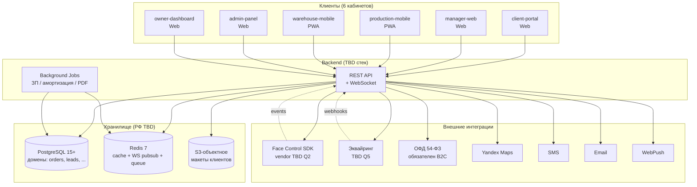
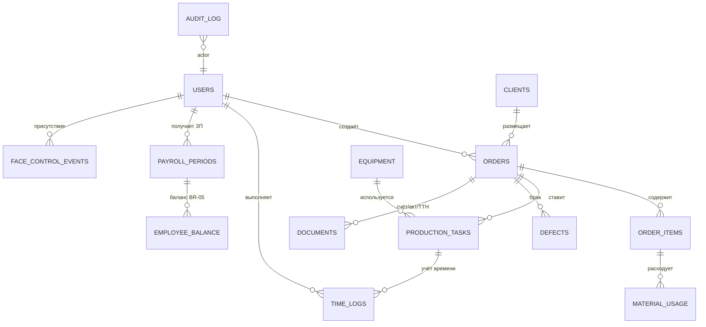

# 03 · Архитектура UniPrint ERP & Client System

> **Статус:** СКЕЛЕТ (обновлено 2026-05-05 после ответов клиента —
> 14/20 закрыто). Phase-0 (discovery / прототип на моках). Открытые
> 🔴 — Q1 юрисдикция, Q2 Face Control vendor, Q3 хостинг, Q4 миграция,
> Q5 эквайринг (см. `Docs/onboarding/owner-questions.md` + memory
> `project_owner_answers_2026-05-05`).
>
> **Закреплённые решения:** Mobile=PWA, Telegram **НЕ** в продукте,
> Yandex Maps + Yandex Object Storage, один цех/склад MVP.
>
> **Назначение документа:** зафиксировать high-level картину системы,
> явно отделить **зафиксированные допущения для прототипа** от **TBD-зон**
> (помечены `TBD после 🔴 #N`), чтобы команда могла строить прототип
> и спеку **параллельно** с дискавери.
>
> **Living-doc:** обновляется при каждом ADR; перед финальным КП
> пройти полный pass и убрать все `TBD`-маркеры.

---

## Содержание

1. [Зафиксированные допущения и TBD-зоны](#1-зафиксированные-допущения-и-tbd-зоны)
2. [High-level схема системы](#2-high-level-схема-системы)
3. [Frontend — 6 кабинетов](#3-frontend--6-кабинетов)
4. [Backend — модули и стек](#4-backend--модули-и-стек)
5. [База данных — домены](#5-база-данных--домены)
6. [Real-time — WebSocket](#6-real-time--websocket)
7. [Background jobs](#7-background-jobs)
8. [Mobile App](#8-mobile-app)
9. [Provider-абстракции](#9-provider-абстракции)
10. [Multi-tenancy](#10-multi-tenancy)
11. [API-контракты — высокоуровневая карта](#11-api-контракты--высокоуровневая-карта)
12. [Нефункциональные требования (NFR)](#12-нефункциональные-требования-nfr)
13. [Запланированные ADR](#13-запланированные-adr)
14. [Открытые вопросы (TBD)](#14-открытые-вопросы-tbd)

---

## 1. Зафиксированные допущения и TBD-зоны

### 1.1 Phase-0 / прототип (зафиксировано)

| Слой | Решение | Обоснование |
| --- | --- | --- |
| Frontend (web) | Next.js **16** App Router + React 19 + TypeScript + Tailwind 4 + shadcn/ui | Стандарт для greenfield 2026, быстрая итерация, Vercel-нативность |
| Mocks | **MSW** (Mock Service Worker) | Bridge между прототипом и future-prod backend без переписывания UI |
| Mobile (Phase-0 + Phase-1+) | **PWA mobile-first** (Service Worker + manifest, viewport-targeted layouts). **Q6 ✅ закреплено — native не в Phase-1, рассмотрение фаза 3+ при необходимости hardware-доступа** | Один codebase, дешевле, ADR-0001 закреплён |
| Hosting прототипа | **Vercel preview** (по push в feature-ветку) | Быстрая демонстрация клиенту, **PWS без реальных ПДн** (mock data) |
| Monorepo | **Turborepo** + pnpm workspaces | Стандарт для multi-app фронта |
| Compliance прототипа | `prototype/MOCK_NOTICE.txt` — фиксирует, что данные синтетические, реальные ПДн в моках запрещены | Vercel за пределами РФ → 152-ФЗ ст. 18 ч. 5 запрещает реальные ПДн |

### 1.2 Production (TBD)

Все production-решения закрепляются ADR'ами **после ответов клиента
🔴 1–7**. Сводка зон неопределённости:

| Слой | Зависимость | Статус |
| --- | --- | --- |
| Backend-стек | команда + нагрузка | `TBD после ADR-0004` (Django+DRF vs Node/NestJS) |
| Mobile-стек | ✅ Q6 закрыт | **PWA mobile-first** (Next.js + SW + manifest). Native не в Phase-1. |
| Хостинг | юрисдикция РФ + ПДн | `TBD после 🔴 Q1, Q3 / ADR-0003` |
| Face Control vendor | бюджет + санкции | `TBD после 🔴 Q2 / ADR-0002` |
| Эквайринг | банк-партнёр клиента | `TBD после 🔴 Q5 / ADR-0005` |
| ОФД-провайдер | подключение к эквайрингу | `TBD под-блокер Q5` (B2C есть, Q14 ✅ — ОФД обязателен) |
| Миграция legacy | источник данных | `TBD после 🔴 Q4` (1С / Excel / нет) |
| Карты | ✅ Q10 закрыт | **Yandex Maps** |
| S3-хранилище | ✅ Q11 закрыт | **Yandex Object Storage** (регион зависит от Q3) |
| Каналы нотификаций | ✅ Q7 закрыт | **SMS + Email + WebPush** (Telegram **НЕ** в продукте) |
| Документооборот | ✅ Q13 закрыт | **PDF-генерация** (счёт/договор/акт/ТТН) + S3 + audit-log. ЭДО — фаза 2+ |
| Multi-tenancy | роадмап | один цех/склад MVP (Q9 ✅), multi-warehouse FK ready, расширение — ADR-0006 фаза 2+ |

---

## 2. High-level схема системы



**Ключевые принципы:**

- **Provider-абстракция** для всех внешних сервисов — `interface` +
  ≥1 mock-impl (для прототипа) + ≥1 real-impl (для prod). Меняем
  vendor — меняем impl, не UI.
- **Все ПДн — в РФ** (после 🔴 #3) на хостинге из списка Yandex.Cloud /
  Selectel / VK Cloud / on-prem. Прототип на Vercel допустим только
  потому, что данные синтетические.
- **Audit-log** на доступы к ПДн — обязательный модуль (152-ФЗ).
- **Биометрия** (шаблоны Face Control) — отдельный защищённый storage
  (Yandex Lockbox / on-prem KMS), отдельный contract на доступ.

---

## 3. Frontend — 6 кабинетов

```
prototype/
├── apps/
│   ├── client-portal/           # Web — внешний клиент типографии
│   ├── manager-web/             # Web — менеджер по продажам
│   ├── production-mobile/       # PWA mobile-first — производство
│   ├── warehouse-mobile/        # PWA mobile-first — склад / монтаж
│   ├── admin-panel/             # Web — администратор + руководитель
│   └── owner-dashboard/         # Web — учредитель / директор (BI)
└── packages/
    ├── tokens/                  # Дизайн-токены (Tailwind config)
    ├── ui/                      # shadcn/ui + кастомные компоненты
    ├── mocks/                   # MSW handlers по доменам
    └── types/                   # TypeScript типы доменов (shared)
```

### 3.1 Граница ответственности кабинетов

| Кабинет | Основная роль | Ключевые сценарии |
| --- | --- | --- |
| `client-portal` | Клиент типографии | Создать заказ, загрузить макет, отследить статус, оплатить, скачать акт |
| `manager-web` | Менеджер продаж | Завести лид, перевести в заказ, согласовать макет, контролировать сроки |
| `production-mobile` | Печатник / лазерщик / монтажник | Видеть очередь задач, «Начать / Завершить работу», фото готового изделия |
| `warehouse-mobile` | Складщик | Приёмка материалов, списание на заказ, инвентаризация, **фиксация брака** (BR-03) |
| `admin-panel` | Администратор | Справочники услуг / материалов, нормативы, пользователи и роли |
| `owner-dashboard` | Учредитель / директор | KPI сотрудников, P&L, прибыль по заказам, простои, брак |

### 3.2 Mobile-first для production / warehouse

- Touch-target ≥ 44pt, single-hand reach.
- Offline-mode: read-only кэш заказа в `localStorage` + `IndexedDB`,
  очередь действий при потере сети (sync при возврате online).
  Финал стратегии — после ADR-0001.
- Service Worker для PWA, **WebPush** через VAPID (FCM/APNs не нужны
  — Q7 закрыт, Telegram не используется в продукте).

---

## 4. Backend — модули и стек

### 4.1 Стек — TBD

`TBD после ADR-0004` (выбор backend-стека по команде/нагрузке).
Mobile=PWA уже закреплён (Q6 ✅), backend от mobile не зависит.

**Кандидаты:**

| Стек | За | Против |
| --- | --- | --- |
| **Django 5 + DRF + Celery** | Зрелый ORM, admin-панель «из коробки», богатый ecosystem для бухгалтерских/финансовых формул, прост в найме junior-mid Python в РФ | Меньше нативная интеграция с TS-моделями фронта, медленнее WS (Channels) |
| **Node 22 + NestJS + BullMQ + Prisma** | Полностью TS end-to-end (shared types frontend ↔ backend), нативный WebSocket, лучшая DX для realtime | Сложнее найм senior Node в РФ, ORM Prisma слабее в complex queries |

**Критерии выбора в ADR-0004:**

1. Профиль команды (Python vs TS-разработчики).
2. Профиль нагрузки: 20+ одновременных пользователей по NFR 9.1, но
   реальный объём — после 🔴 #12 (заказов в день).
3. Сложность бухгалтерских расчётов (амортизация / ЗП / себестоимость) —
   Django классически проще для этого.
4. Скорость developmenta MVP — Node быстрее в realtime / API-routes,
   Django быстрее в admin-CRUD.

### 4.2 Структура модулей

Структура `apps/<name>/` (для Django-варианта) или `src/modules/<name>/`
(для NestJS-варианта). Финал — после ADR-0004. Доменное разбиение
**не зависит от стека**:

| Модуль | Назначение | Связь с ТЗ |
| --- | --- | --- |
| `catalog` | Справочники услуг, товаров, материалов, операций, нормативов | § 6.4, § 6.10 |
| `orders` | Заказы (3 типа: цех / офис / товар), статус-машина | § 6.1, BR-07 |
| `leads` | Выездные продажи, лид → заказ | § 6.2 |
| `clients` | Клиенты + антидублирование по телефону | § 6.3, BR-02 |
| `design` | Макеты, версии, согласование | § 6.5, § 6.6 |
| `production` | Производственные задачи + статус-машина изделия | § 6.7 |
| `time_tracking` | «Начать / Завершить» работу | § 6.8 |
| `workload` | Загрузка сотрудников, простои | § 6.9 |
| `warehouse` | Склад + приёмка + списание на заказ (BR-01) | § 6.11 |
| `defects` | Брак (фиксирует только складщик — BR-03) | § 6.12, § 6.13 |
| `payroll` | Сдельная ЗП + баланс сотрудника (BR-05) | § 6.22, § 7.12, § 7.15 |
| `finance` | Себестоимость, прибыль, налоги, амортизация | § 7.9–7.18 |
| `logistics` | Водители, доставка, маршруты | § 6.24, § 7.18 |
| `equipment` | Оборудование, наработка, ТО, амортизация | § 6.25, § 7.17 |
| `docflow` | Счета / договоры / акты / ТТН (PDF + хранение 5 лет) | § 6.23 |
| `face_control_adapter` | **Provider-абстракция** Face Control + хранение биометрии | § 6.20 |
| `notifications` | **Provider-абстракция** WebPush / SMS / Email (Telegram **исключён** — Q7 ✅) | § 6.16 |
| `audit_log` | Audit-log на ПДн + изменения данных (152-ФЗ) | § 8.3 |
| `users` | Пользователи, роли, RBAC | § 6.19, § 8.2 |
| `analytics` | Отчёты + KPI | § 6.18 |
| `client_portal_api` | API только для внешнего клиента (изолированный поверхностный модуль) | § 6.15 |

### 4.3 Граница `face_control_adapter` (выделена)

Из-за критичности 152-ФЗ ст. 11 (биометрия) — модуль изолирован:

- Один интерфейс наружу: `register_template`, `verify`, `events_stream`.
- Vendor-impl за `FaceControlProvider` interface (mock / NtechLab / Hikvision / Suprema).
- Шаблоны (биометрические templates) хранятся **отдельно** от основной БД —
  в защищённом storage (Yandex Lockbox или on-prem KMS), доступ
  только из adapter'а.
- Audit-log на каждый доступ.
- Финал — после ADR-0002 (`Docs/09-compliance.md` § биометрия).

---

## 5. База данных — домены

**СУБД:** PostgreSQL 15+ (фиксировано, нет TBD — индустриальный стандарт).



### 5.1 Домены БД

- `catalog` — `services`, `service_categories`, `materials`,
  `material_batches`, `operations`, `norms`
- `orders` — `orders`, `order_items`, `order_status_history`
- `leads` — `leads`, `measurements`, `lead_attachments`
- `clients` — `clients` (с unique-индексом по `phone_normalized`)
- `design` — `designs`, `design_versions`, `design_approvals`
- `warehouse` — `material_movements`, `inventory_audits`
- `defects` — `defects` (с фото в S3)
- `production` — `production_tasks`, `task_assignments`
- `time_tracking` — `time_logs`
- `payroll` — `payroll_periods`, `employee_balance`,
  `pay_slips` (расчётные листы по ст. 136 ТК)
- `finance` — `cost_breakdowns`, `profit_reports`, `tax_calculations`,
  `equipment_amortization`
- `logistics` — `vehicles`, `routes`, `delivery_orders`
- `equipment` — `equipment`, `equipment_usage_log`,
  `maintenance_schedules`
- `docflow` — `documents` (счёт / договор / акт / ТТН с метаданными
  и ссылкой на S3)
- `face_control` — `face_control_events` (только timestamps + user_id +
  type, **без шаблонов** — те в защищённом KMS)
- `users` — `users`, `roles`, `permissions`, `role_assignments`,
  `consents` (общее ПДн + биометрия отдельно)
- `audit_log` — `audit_log_entries` (append-only)
- `notifications` — `notification_jobs`, `notification_outbox`

### 5.2 Соглашения

- Все таблицы имеют `id` (UUID), `created_at`, `updated_at`,
  `deleted_at` (soft-delete).
- ПДн-поля помечены тегом в схеме (для autogen политики удаления).
- Все таблицы с `branch_id` / `company_id` FK с дефолтом — для
  multi-tenancy в фазе 2 (см. § 10).
- Бэкап: PG PITR (point-in-time-recovery) — обязательно, RPO ≤ 1ч,
  RTO ≤ 4ч (целевые, финал в ADR-0003).

---

## 6. Real-time — WebSocket

**Каналы:**

| Канал | Кто слушает | Что транслируем |
| --- | --- | --- |
| `orders/{id}` | менеджер, клиент, производство | Изменения статуса, прогресс задач |
| `production/queue/{branch_id}` | производство | Новые задачи в очереди |
| `face_control/events` | admin-panel, owner-dashboard | События входа / выхода (real-time для дашборда учредителя) |
| `notifications/{user_id}` | любой кабинет | Push-нотификации в UI |

**Реализация — TBD после ADR-0004:**

- Если Django: **Django Channels** + Redis pubsub.
- Если NestJS: встроенный `@nestjs/websockets` + Redis pubsub.

---

## 7. Background jobs

**Очередь — TBD после ADR-0004:**

- Django → **Celery** + Redis broker.
- NestJS → **BullMQ** + Redis.

**Задачи:**

| Задача | Тип | Триггер |
| --- | --- | --- |
| Расчёт ЗП за период | Cron (ежемесячно или ежедекадно) | По расписанию |
| Расчёт амортизации оборудования | Cron (ежесуточно) | По расписанию |
| Генерация PDF счетов / актов / ТТН | Async event | На событие смены статуса заказа |
| Импорт `face_control_events` | Real-time worker | Webhook от Face Control vendor |
| Recalc баланса сотрудника | Async event | После закрытия `pay_slip` |
| Cleanup истёкших ПДн (152-ФЗ ст. 14) | Cron (ежесуточно) | По расписанию |
| Отправка нотификаций (SMS/Email/WebPush) | Async event | На бизнес-события |

---

## 8. Mobile App

**Phase-0 / прототип:** PWA mobile-first в `prototype/apps/{production-mobile,
warehouse-mobile}/`.

**Production:** `TBD после 🔴 #6 / ADR-0001`. Кандидаты:

| Вариант | Когда | Стоимость (отн.) |
| --- | --- | --- |
| **PWA-only** (web + Service Worker) | Если бюджет малый, MVP | × 1 |
| **React Native + Expo** | Если нужен push на iOS, лучший UX | × 1.5 |
| **Flutter** | Если нужны hardware-features (GPS-трек водителя, камера со стримом) | × 1.5 |
| **Native (Kotlin + Swift)** | Если premium UX, offline-first для производства | × 2 |
| **Гибрид:** PWA фаза 1 + native фаза 2 | Default-рекомендация | × 1 (фаза 1) + × 1 (фаза 2) |

**Базовые требования к Mobile (любой стек):**

- Offline-mode для производства и склада (queue + sync).
- Camera API для фиксации брака с фото.
- GPS для водителей (модуль 6.24).
- Face Control камера (на стороне Mobile App для отметки начала смены).
- Push-notifications (FCM / APNs).
- Service Worker / FG-tasks для long-running операций.

---

## 9. Provider-абстракции

**Принцип:** каждая внешняя интеграция за `interface`. На прототипе —
mock-impl, на prod — реальный vendor. Подмена vendor'а = подмена
impl, не переписывание UI.

| Модуль | Interface | Mock | Real (TBD) |
| --- | --- | --- | --- |
| `face_control_adapter` | `FaceControlProvider` (`register / verify / events`) | `MockFaceControl` (синтетические события) | NtechLab / Hikvision / Suprema (ADR-0002) |
| `notifications` | `NotificationProvider` (`send`) — отдельные impl на канал | `MockNotification` (UI-toast в кабинетах) | SMSAero/MTS Exolve / Unisender Go / WebPush VAPID |
| `payments` | `PaymentProvider` (`create_payment / capture / refund / status`) | `MockPayments` | YooKassa / Тинькофф / Сбер (ADR-0005) |
| `maps` | `MapsProvider` (`geocode / route / distance`) | `MockMaps` (фиксированные координаты) | Yandex Maps / 2GIS |
| `files_storage` | `StorageProvider` (`upload / download / signed_url`) | `MockStorage` (in-memory) | Yandex Object Storage / Selectel / VK Cloud |
| `fiscal_ofd` | `FiscalProvider` (`emit_receipt`) | `MockFiscal` (no-op) | Платформа ОФД / Такском (если 54-ФЗ) |
| `edi_documents` | `EDIProvider` | `MockEDI` | Контур.Диадок / СБИС (фаза 2+) |

**Подробности и edge-кейсы:** см. `Docs/05-integrations.md`.

---

## 10. Multi-tenancy

**Фаза 1 (MVP):** **single-tenant** — одна типография, один контур.

**Фаза 2+ (multi-tenancy):** `TBD после ADR-0006`. Подготовка:

- Все доменные таблицы имеют `company_id` / `branch_id` FK.
- Default `company_id = 1` для MVP (один tenant).
- При активации — RLS (Row-Level Security в PG) + middleware
  на API-слое.
- Шардирование S3-bucket'ов по `company_id`.

**Триггер активации фазы 2:** появление второго клиента-типографии
или multi-warehouse в одной компании (вопрос Q9 в `owner-questions.md`).

---

## 11. API-контракты — высокоуровневая карта

**Стиль:** REST + JSON, версионирование через `/api/v1/`.
WebSocket — отдельный namespace `/ws/`.

```
/api/v1/
├── auth/                       # phone+password, OTP, magic-link
│   ├── login
│   ├── logout
│   └── refresh
├── orders/
│   ├── GET    /                # список (с фильтрами)
│   ├── POST   /                # создать
│   ├── GET    /{id}
│   ├── PATCH  /{id}            # смена статуса (по машине)
│   └── POST   /{id}/items
├── leads/
│   └── ... (похоже на orders)
├── clients/
│   ├── GET    /                # с антидубль-проверкой по phone
│   └── POST   /
├── catalog/
│   ├── services/
│   ├── materials/
│   ├── operations/
│   └── norms/
├── warehouse/
│   ├── movements/              # списания (только на заказ — BR-01)
│   └── inventory/
├── defects/
│   └── POST   /                # только role=warehouse — BR-03
├── production/
│   ├── tasks/
│   └── time_logs/              # «Начать / Завершить»
├── payroll/
│   ├── periods/
│   ├── pay_slips/              # ст. 136 ТК
│   └── balance/                # BR-05
├── finance/
│   ├── cost_breakdowns/
│   └── profit_reports/
├── face_control/
│   ├── events/                 # GET only — read-only по BR-06
│   └── consents/               # POST — биометрическое согласие
├── files/
│   └── POST   /presigned       # upload presigned URL для макетов
├── notifications/
│   └── outbox/                 # история отправленных
├── audit_log/                  # role=admin only
└── analytics/                  # role=owner / role=admin
    └── reports/
```

**Детальный OpenAPI 3.1 спек:** `TBD после ADR-0004` (формат + кодогенерация
зависят от выбранного стека).

---

## 12. Нефункциональные требования (NFR)

**Источник:** ТЗ § 9 + § 9.10–9.11 (дополнение).

| NFR | Требование | Архитектурное следствие |
| --- | --- | --- |
| 9.1 Производительность | Время отклика ≤ 2с standart, ≤ 5с complex; ≥ 20 одновременных | PG indexes по hot-path; Redis cache на справочники; async-задачи на тяжёлые расчёты |
| 9.1 Realtime | Учёт времени, статусы, действия — real-time | WebSocket для production task progress; Redis pubsub |
| 9.2 Надёжность | Без потери данных при сбоях | Транзакции на критичные операции; idempotency keys на API; PG PITR backups |
| 9.3 Масштабируемость | Рост пользователей / заказов | Stateless backend + horizontal scale; multi-tenancy ready (§ 10) |
| 9.4 Доступность | 24/7, mobile + web | SLA ≥ 99% (целевой, финал в ADR-0003); managed PG с auto-failover |
| 9.6 Безопасность | Защита ПДн, RBAC | 152-ФЗ baseline (см. § 13 Compliance); шифрование at-rest |
| 9.7 Backup | Регулярные авто-бэкапы | PG PITR (RPO ≤ 1ч); S3 lifecycle с replication; runbook на restore |
| 9.8 Usability | Обучение ≤ 1 дня | Mobile-first для cеха / склада; minimum-tap UX |
| 9.9 Совместимость | Современные браузеры, mobile-устройства | Next.js 16 + React 19 (autoprefix) + PWA |
| 9.10 Хранение макетов | ≥ 12 мес гарантированно | S3 lifecycle с переходом в Cold Storage после 90 дней без доступа |
| 9.11 Методы оплаты | Cash / эквайринг / р/с | `PaymentProvider` абстракция (§ 9); статус оплаты ↔ статус заказа |
| **mobile-latency** | Критичные операции (Начать / Завершить работу, скан штрих-кода) ≤ 1с на cellular | Edge-cached PWA shell; offline-queue на потеря сети |

**Уточнение целевых SLO:** `TBD после 🔴 #12` (объём операций) и `ADR-0003`
(хостинг с реальными SLA).

---

## 13. Запланированные ADR

ADR хранятся в `Docs/adr/NNNN-<slug>.md` (формат Майкла Найгардта:
Context / Decision / Consequences). Закрываются после ответов 🔴.

| ADR | Зона | Зависит от | Cтатус |
| --- | --- | --- | --- |
| **ADR-0001** | Mobile-стек (PWA / RN / Flutter / native / гибрид) | 🔴 #6 | TBD |
| **ADR-0002** | Face Control vendor + хранение биометрических шаблонов (152-ФЗ ст. 11 — см. `Docs/09-compliance.md`) | 🔴 #2 | TBD |
| **ADR-0003** | Хостинг и юрисдикция (152-ФЗ ст. 18 ч. 5 — см. `Docs/09-compliance.md`) | 🔴 #1, #3 | TBD |
| **ADR-0004** | Backend-стек (Django+DRF vs Node+NestJS) | команда + 🔴 #12 (нагрузка) | TBD |
| **ADR-0005** | Эквайринг и приём оплат (+ 54-ФЗ ОФД при B2C) | 🔴 #5, Q14 | TBD |
| **ADR-0006** | Multi-tenancy strategy (фаза 2+) | продуктовая стратегия | TBD |

**Связи между ADR:**

- ADR-0003 предшествует ADR-0002 (если хостинг on-prem — биометрию
  храним локально; если cloud — Yandex Lockbox).
- ADR-0004 не зависит от ADR-0001 (стек backend независим от mobile,
  оба общаются через REST + WS).
- ADR-0005 зависит от ADR-0003 (юрисдикция → допустимые провайдеры).

---

## 14. Открытые вопросы (TBD)

| # | Вопрос | Зависимость | Где будет финал |
| --- | --- | --- | --- |
| TBD-1 | Юрисдикция и юр-лицо | `🔴 #1 — Q1` | ADR-0003 + `Docs/09-compliance.md` |
| TBD-2 | Face Control vendor | `🔴 #2 — Q2` | ADR-0002 |
| TBD-3 | Хостинг и регион | `🔴 #3 — Q3` | ADR-0003 |
| TBD-4 | Миграция legacy-данных | `🔴 #4 — Q4` | sprint-1 milestone + `Docs/runbook/migration/` |
| TBD-5 | Эквайринг + ОФД | `🔴 #5 — Q5, Q14` | ADR-0005 + `Docs/05-integrations.md` |
| TBD-6 | Mobile-стек | `🔴 #6 — Q6` | ADR-0001 |
| TBD-7 | ~~Telegram-канал~~ ✅ Q7 закрыт — **исключён из продукта** | — | — |
| TBD-8 | Backend-стек | команда + нагрузка | ADR-0004 |
| TBD-9 | Объём операций | `🔴 #12 — Q12` | ADR-0003 (sizing) |
| TBD-10 | Multi-warehouse в v1 | `🔴 #9 — Q9` | ADR-0006 |
| TBD-11 | OpenAPI спек | ADR-0004 | `Docs/api/openapi.yaml` (после старта backend) |
| TBD-12 | SLO / SLI | ADR-0003 + 🔴 #12 | `Docs/runbook/slo.md` |

**Ссылки:**

- `Docs/onboarding/owner-questions.md` — 20 вопросов 🔴/🟡/🟢
- `Docs/05-integrations.md` — карта внешних интеграций
- `Docs/09-compliance.md` — регуляторика РФ + биометрия
- `BUSINESS_RULES.md` — инварианты BR-01 … BR-07
- `CLAUDE.md` § «Стек», § «Архитектура» — actual snapshot
- `Docs/team-structure.md` § 4 Tech Lead — owner этого документа
