# 04 — Модули UniPrint ERP & Client System

> **Living-doc.** Детализация всех 25 функциональных модулей из ТЗ
> (`tz-po-uniprint.md` § 6 + `tz-dop-modules.md` § 6.23–6.25) и блока
> расчётов § 7. Источник правды — ТЗ заказчика и зафиксированные
> ответы владельца (2026-05-05).
>
> **Парные документы:** `BUSINESS_RULES.md` (BR-01..36), `Docs/03-architecture.md`
> (компоненты), `Docs/05-integrations.md` (внешние интеграции),
> `Docs/09-compliance.md` (152-ФЗ / ТК / 402-ФЗ / 54-ФЗ),
> `Docs/10-bpmn.md` (BPMN-схемы).

## Содержание

1. [Как читать этот документ](#как-читать-этот-документ)
2. [Маппинг модулей на apps/*](#маппинг-модулей-на-apps)
3. [Карта модулей и зависимостей](#карта-модулей-и-зависимостей)
4. [CRM (6.1–6.4)](#часть-i--crm-61--64)
5. [Производство (6.5–6.10)](#часть-ii--производство-65--610)
6. [Склад и качество (6.11–6.13)](#часть-iii--склад-и-качество-611--613)
7. [Продажи и кабинет (6.14–6.15)](#часть-iv--продажи-и-кабинет-614--615)
8. [Прочее (6.16–6.22)](#часть-v--прочее-616--622)
9. [Дополнение (6.23–6.25)](#часть-vi--дополнение-623--625)
10. [Расчёты § 7](#часть-vii--расчёты--7)
11. [Cross-module flows](#часть-viii--cross-module-flows)

---

## Как читать этот документ

Каждый модуль описан в стандартной структуре:

```
## 6.X — Название
**Назначение:** 1-2 предложения, бизнес-цель.
**Источник в ТЗ:** § 6.X / § 7.Y.
**Backend mapping (apps/*):** имя соответствующего apps-модуля.

### Модель данных
Список сущностей с атрибутами, FK, важными константами.
Mermaid `erDiagram` для центральных модулей.

### Бизнес-инварианты (BR-XX)
Перечень BR из BUSINESS_RULES.md, применимых к модулю.

### Статус-машина
Mermaid `stateDiagram-v2` (если есть).

### Права по ролям (RBAC)
Таблица роль × CRUD + спец. действия.

### API endpoints (черновик)
REST-naming. Не финал — black-box до ADR-0004 backend-стек.

### Открытые вопросы / TBD
Ссылки на 🔴 Q1–Q5 если зависит.
```

**Соглашения.** TBD после 🔴 #N — означает, что финальный ответ
зависит от закрытия блокера N (`Docs/onboarding/owner-questions.md`).
**Закрытые ответы 2026-05-05** (PWA, Yandex Maps, Yandex Object
Storage, без Telegram-продукта, ОФД нужен, MVP one-warehouse,
двойная формула ЗП) — фиксированные допущения, **не** маркируются
TBD.

## Маппинг модулей на apps/*

> Backend-структура — placeholder до ADR-0004 (Django/DRF vs Node/NestJS).
> Имена `apps/<name>` — соглашение для черновых разработческих
> обсуждений; в конкретном фреймворке могут быть `services/<name>`,
> `domain/<name>` и т.д.

| ТЗ модуль | `apps/*` | Тип | Зависимости |
| --- | --- | --- | --- |
| 6.1 CRM (Заказы) | `apps/orders` | core | clients, catalog, payroll, warehouse, design |
| 6.2 Лиды | `apps/leads` | core | clients, orders |
| 6.3 Клиенты | `apps/clients` | core | (ничего; root-сущность) |
| 6.4 Услуги/товары | `apps/catalog` | core | (root) |
| 6.5 Дизайн | `apps/design` | feature | orders, S3 |
| 6.6 Согласование макетов | `apps/design_review` | feature | design, orders, notifications |
| 6.7 Производство | `apps/production` | core | orders, catalog, warehouse, equipment |
| 6.8 Учёт времени | `apps/time_tracking` | core | production, employees |
| 6.9 Контроль загрузки | `apps/workload` | analytics | time_tracking, face_control |
| 6.10 Нормирование | `apps/norms` | core | catalog (admin-only) |
| 6.11 Склад | `apps/warehouse` | core | catalog, orders |
| 6.12 Брак | `apps/defects` | feature | warehouse, production |
| 6.13 Повторное производство | внутри `apps/defects` | feature | defects, production |
| 6.14 Продажа товара | `apps/goods_sales` | feature | orders, catalog (товар), payments |
| 6.15 Клиентский кабинет | `apps/client_portal` (frontend) | UX | orders, design_review, payments, docflow |
| 6.16 Уведомления | `apps/notifications` | core | (используется всеми) |
| 6.17 Постобслуживание | `apps/aftercare` | feature | orders |
| 6.18 Аналитика | `apps/analytics` | analytics | (read all) |
| 6.19 Управление пользователями | `apps/users` (auth + RBAC) | core | (root) |
| 6.20 Face Control | `apps/face_control` (+ adapter) | integration | users, time_tracking |
| 6.21 KPI | внутри `apps/workload` | analytics | time_tracking, face_control |
| 6.22 Сдельная ЗП и баланс | `apps/payroll` | core | production, time_tracking, norms |
| 6.23 Документооборот | `apps/docflow` | feature | orders, S3, payments |
| 6.24 Логистика | `apps/logistics` | feature | orders, equipment (авто) |
| 6.25 Мониторинг оборудования | `apps/equipment` | feature | production, notifications |
| Cross-cutting | `apps/audit_log`, `apps/fiscal` (54-ФЗ ОФД), `apps/payments` (эквайринг) | infra | (используются всеми) |

## Карта модулей и зависимостей

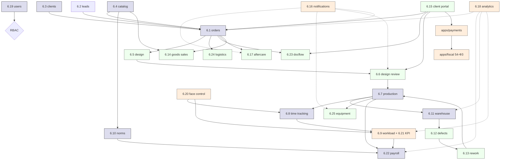

---

## Часть I — CRM (6.1 – 6.4)

## 6.1 — Управление заказами (CRM)

**Назначение:** ядро системы. Создание, редактирование, управление
жизненным циклом заказа всех 3 типов (цех / офис / товар).
**Источник в ТЗ:** § 6.1, § 5.1.
**Backend mapping:** `apps/orders`.

### Модель данных

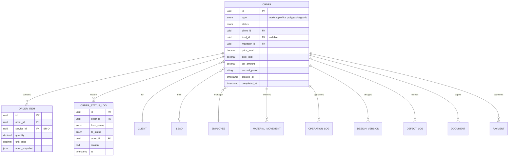

### Бизнес-инварианты

- **BR-02** Антидублирование клиентов (через client_id).
- **BR-04** order_item.service_id обязательно из справочника.
- **BR-07** type immutable после создания.
- **BR-10** Нельзя завершить без списанных материалов и времени.
- **BR-12** При completed → создание followup_task.
- **BR-13** Полная история изменений (audit_log).
- **BR-19** accrual_period обязателен.
- **BR-20** Все статусы → order_status_log.
- **BR-30** Синхронизация с payment-статусом.
- **BR-32** Клиент видит только свои.
- **BR-34** Производство не редактирует параметры.

### Статус-машина

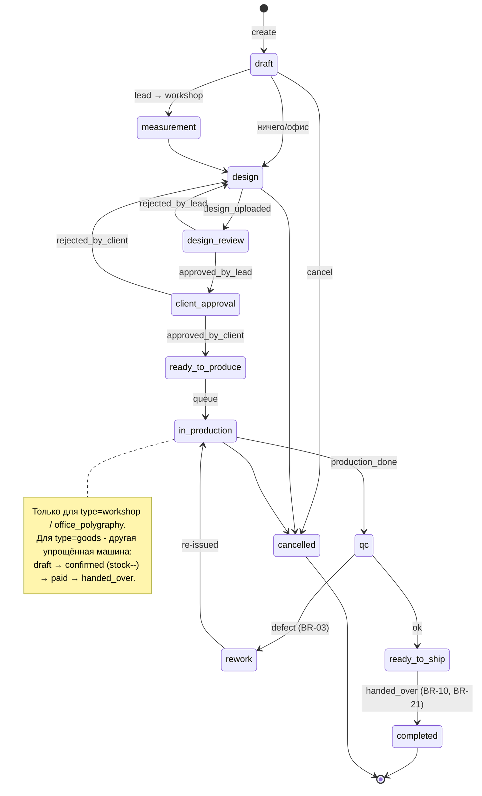

### Права по ролям (RBAC)

| Действие | Менеджер | Дизайнер | Производство | Складщик | Админ | Клиент | Owner (RO) |
| --- | --- | --- | --- | --- | --- | --- | --- |
| Create order | ● | — | — | — | ● | ● (свой) | — |
| Edit params (size, price, client) | ● | — | — | — | ● | ●(до design) | — |
| Set status to design | ● | ● | — | — | ● | — | — |
| Set status to in_production | — | — | — | — | ●/Lead | — | — |
| Add design version | — | ● | — | — | ● | — | — |
| Operation start/finish | — | — | ● | — | ● | — | — |
| Material write-off | — | — | — | ● | ● | — | — |
| Defect log | — | — | — | ● | ● | — | — |
| Cancel | ● | — | — | — | ● | ●(до design) | — |
| View own | ● | ●(assigned) | ●(assigned) | ●(assigned) | ● | ● | ● |
| View all | ●(department) | — | — | ●(active) | ● | — | ● |

### API endpoints (черновик)

```
GET    /api/v1/orders?type=&status=&client_id=&assignee=  — list (filtered by RBAC)
POST   /api/v1/orders                                     — create
GET    /api/v1/orders/{id}                                — detail
PATCH  /api/v1/orders/{id}                                — update (BR-07: not type)
POST   /api/v1/orders/{id}/transition                     — status change (BR-20)
POST   /api/v1/orders/{id}/items                          — add item (BR-04)
DELETE /api/v1/orders/{id}/items/{item_id}                — remove
GET    /api/v1/orders/{id}/history                        — audit log (BR-13)
POST   /api/v1/orders/{id}/cancel                         — cancel
GET    /api/v1/orders/{id}/cost-breakdown                 — RBAC fields (BR-32)
```

### Открытые вопросы / TBD

- НДС/налоги в `price_total` — TBD после 🔴 Q1 (юрисдикция),
  см. `Docs/onboarding/owner-questions.md § Q1`.

---

## 6.2 — Лиды (Выездные продажи)

**Назначение:** работа с потенциальными клиентами от первичного
контакта до конвертации в заказ.
**Источник в ТЗ:** § 6.2, § 5.1.1.1, § 5.1.1.2.
**Backend mapping:** `apps/leads`.

### Модель данных

- `Lead`: id, source (cold_call, referral, walkin), status (new |
  contacted | measured | proposal | converted | lost), client_id (FK,
  nullable до знакомства), manager_id, address, photos[], measurements
  (json), notes, **converted_order_id (UNIQUE NULLable)**, lost_reason.
- `LeadActivity`: id, lead_id, type (call, visit, message), notes, ts.

### Бизнес-инварианты

- **BR-08** 1 лид → максимум 1 заказ (UNIQUE на converted_order_id).
- **BR-02** Через client_id (нормализация по телефону при заведении).

### Статус-машина

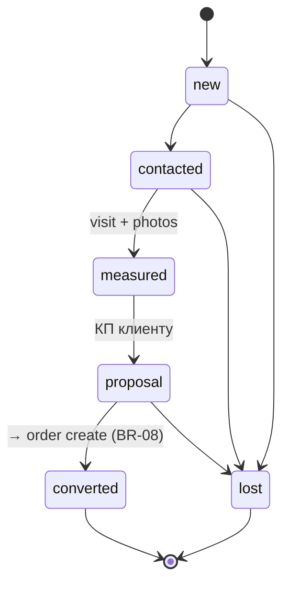

### Права по ролям (RBAC)

| Действие | Менеджер (выездной) | Менеджер (офисный) | Админ | Owner |
| --- | --- | --- | --- | --- |
| Create / edit лид | ● | ● | ● | — |
| Конвертация в заказ | ● | ● | ● | — |
| View | ● (свои) | ● (все) | ● | ● |

### API endpoints

```
GET    /api/v1/leads
POST   /api/v1/leads
PATCH  /api/v1/leads/{id}
POST   /api/v1/leads/{id}/convert  → создаёт order, ставит status=converted
POST   /api/v1/leads/{id}/activities
```

### Открытые вопросы / TBD

— нет блокеров.

---

## 6.3 — Клиенты

**Назначение:** ведение клиентской базы (B2B + B2C).
**Источник в ТЗ:** § 6.3.
**Backend mapping:** `apps/clients`.

### Модель данных

- `Client`: id, type (`B2B | B2C`), full_name (для B2C) / company_name
  (B2B), inn (B2B), phone, **phone_normalized (UNIQUE active)**, email,
  default_address, source, created_at, deleted_at, merged_into_client_id.
- `ClientContact`: id, client_id, name, role, phone, email — для B2B
  доп.контактные лица.
- `ClientAddress`: id, client_id, address_text, lat, lng, is_default.

### Бизнес-инварианты

- **BR-02** Антидублирование по phone_normalized.
- **BR-32** RBAC: клиент видит только свой профиль.

### Статус-машина

— у клиента нет нетривиальной машины (active / merged / inactive).

### Права по ролям (RBAC)

| Действие | Менеджер | Админ | Клиент | Owner |
| --- | --- | --- | --- | --- |
| Create / edit | ● | ● | ●(self) | — |
| Merge dupes | — | ● | — | — |
| View own | ● (assigned) | ● | ●(self) | ● |
| View all | ● | ● | — | ● |

### API endpoints

```
GET    /api/v1/clients?phone=&name=&type=
POST   /api/v1/clients
GET    /api/v1/clients/{id}
PATCH  /api/v1/clients/{id}
POST   /api/v1/clients/merge        (admin only)
GET    /api/v1/clients/check-phone?phone=  → existing_client_id|null
GET    /api/v1/clients/{id}/orders
```

### Открытые вопросы / TBD

— нет блокеров.

---

## 6.4 — Услуги и товары (справочники)

**Назначение:** единый каталог услуг (для типов workshop / office)
и товаров (для типа goods). Защита от дублирования (BR-04, BR-15).
**Источник в ТЗ:** § 6.4, § 6.10.
**Backend mapping:** `apps/catalog`.

### Модель данных

- `Service`: id, name, **name_normalized (UNIQUE active)**, category,
  type (workshop / office), unit (м², шт, м.п.), default_price,
  active, **norm_snapshot** (через `norm_rate`).
- `Material`: id, name, name_normalized, unit, supplier, active.
- `Goods`: id, name, sku (UNIQUE), unit, retail_price, **stock**,
  reorder_threshold.
- `Operation`: id, name, equipment_required (FK list), default_role,
  active.
- `MaterialBatch`: id, material_id, batch_number, received_at,
  qty_initial, qty_remaining, unit_cost.
- `CatalogChangelog`: id, entity, entity_id, before, after, actor,
  reason, ts.

### Бизнес-инварианты

- **BR-04** Запрещён ручной free-text ввод услуг (только из справочника).
- **BR-14** Изменения только админом → audit + snapshot.
- **BR-15** Антидублирование по name_normalized.

### Права по ролям (RBAC)

| Действие | Менеджер | Производство | Складщик | Админ | Owner |
| --- | --- | --- | --- | --- | --- |
| Read services / goods / materials | ● | ●(operations) | ● | ● | ● |
| Create / edit services | — | — | — | ● | — |
| Create / edit materials | — | — | — | ● | — |
| Create / edit norms | — | — | — | ● | — |
| Receipt materials (поступление) | — | — | ● | ● | — |

### API endpoints

```
GET    /api/v1/catalog/services
POST   /api/v1/catalog/services           (admin)
PATCH  /api/v1/catalog/services/{id}      (admin)
GET    /api/v1/catalog/materials
POST   /api/v1/catalog/materials/{id}/batches  (warehouse_keeper)
GET    /api/v1/catalog/goods
GET    /api/v1/catalog/operations
GET    /api/v1/catalog/changelog?entity=
```

### Открытые вопросы / TBD

- Импорт начального справочника — параллельный track в sprint-0
  (R3 + владелец); шаблон CSV-импорта в `apps/catalog`.

---

## Часть II — Производство (6.5 – 6.10)

## 6.5 — Дизайн (макеты)

**Назначение:** подготовка макетов для заказов типа workshop / office;
управление версиями файлов в Yandex Object Storage.
**Источник в ТЗ:** § 6.5, § 5.1.1.4, § 5.1.1.7.
**Backend mapping:** `apps/design`.

### Модель данных

- `DesignVersion`: id, order_id, version_no, designer_id, **s3_key**
  (Yandex Object Storage), file_size, file_hash, status
  (`draft | submitted_to_review | rejected_by_lead | approved_by_lead |
  rejected_by_client | approved_by_client | production_ready`),
  notes, created_at.
- `DesignAsset`: id, version_id, type (`layout | preview | print_ready`),
  s3_key, mime, dimensions.

### Бизнес-инварианты

- **BR-11** Без approved_by_lead — нельзя в производство.
- **BR-33** Хранение макетов ≥ 12 месяцев в Yandex Object Storage.
- **BR-13** Полная история версий (immutable).

### Статус-машина

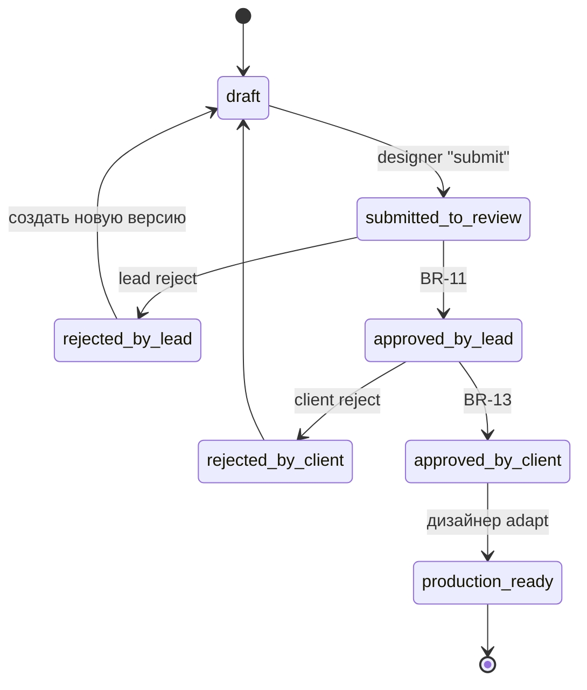

### Права по ролям

| Действие | Дизайнер | Production Lead | Менеджер | Клиент | Админ |
| --- | --- | --- | --- | --- | --- |
| Create version | ● | — | — | — | ● |
| Submit | ● | — | — | — | ● |
| Approve as lead | — | ● | — | — | ● |
| Approve as client | — | — | (proxy) | ● | ● |
| Mark production_ready | ● | — | — | — | ● |

### API endpoints

```
POST   /api/v1/orders/{id}/designs                  (designer)
POST   /api/v1/designs/{id}/submit
POST   /api/v1/designs/{id}/upload-asset            (presigned S3)
POST   /api/v1/orders/{id}/design-reviews/lead      (production_lead)
POST   /api/v1/orders/{id}/design-reviews/client    (client_portal)
GET    /api/v1/orders/{id}/designs                  (full version history)
```

### Открытые вопросы / TBD

- Регион Yandex Object Storage — TBD после 🔴 Q3 (хостинг).

---

## 6.6 — Согласование макетов (Design Review)

**Назначение:** отдельный модуль gate-проверки между дизайном и
производством (производственный руководитель + клиент).
**Источник в ТЗ:** § 6.6, § 5.1.1.5, § 5.1.1.6.
**Backend mapping:** `apps/design_review` (или внутри `apps/design`).

### Модель данных

- `DesignReview`: id, design_version_id, reviewer_role (`production_lead | client`),
  reviewer_id, status (`pending | approved | rejected`),
  comments, decided_at.

### Бизнес-инварианты

- **BR-11** Approved_by_lead — обязательное условие перехода в производство.
- **BR-13** История approve/reject в audit_log.

### Права по ролям

| Действие | Production Lead | Клиент | Менеджер (proxy) | Админ |
| --- | --- | --- | --- | --- |
| Approve / reject as lead | ● | — | — | ● |
| Approve / reject as client | — | ● | ● | ● |
| View | ● | ●(свой) | ● | ● |

### API endpoints

```
POST   /api/v1/design-reviews/{id}/approve
POST   /api/v1/design-reviews/{id}/reject  (с comment)
GET    /api/v1/orders/{id}/design-reviews
```

### Открытые вопросы / TBD

— нет блокеров.

---

## 6.7 — Производство

**Назначение:** ядро производственного флоу — задачи, операции,
выполнение работ.
**Источник в ТЗ:** § 6.7, § 5.1.1.8, § 5.1.1.9.
**Backend mapping:** `apps/production`.

### Модель данных

- `ProductionTask`: id, order_id, operation_id (FK Operation), assignee_id,
  status (`pending | in_progress | done | blocked`), scheduled_start,
  scheduled_end, actual_start, actual_end, equipment_id (FK), notes.
- `OperationLog`: id, task_id, operation_id, employee_id, started_at,
  finished_at, duration_minutes, output_quantity, equipment_id.

### Бизнес-инварианты

- **BR-04** Operation_id из справочника.
- **BR-07** Операции зависят от order.type.
- **BR-10** Time tracked обязательно для completion.
- **BR-34** Производство не меняет параметры заказа.

### Статус-машина (ProductionTask)

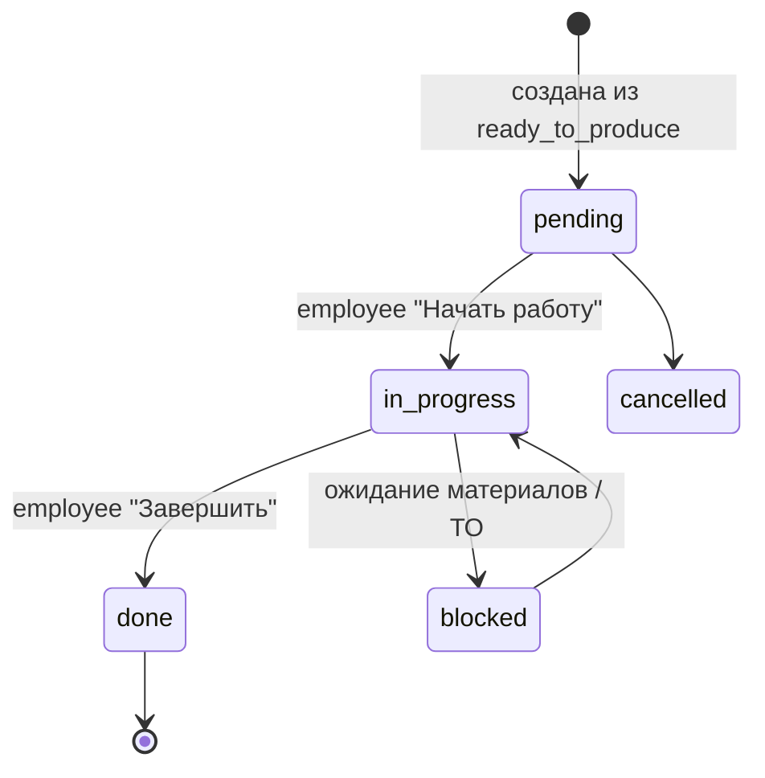

### Права по ролям

| Действие | Производство | Production Lead | Складщик | Админ |
| --- | --- | --- | --- | --- |
| Pickup task | ● | — | — | ● |
| Start / finish operation | ● | — | — | ● |
| Mark blocked | ● | ● | — | ● |
| Reassign | — | ● | — | ● |
| Edit order params | — | — | — | — |

### API endpoints

```
GET    /api/v1/production/tasks?status=&assignee=
POST   /api/v1/production/tasks/{id}/pickup
POST   /api/v1/production/tasks/{id}/start
POST   /api/v1/production/tasks/{id}/finish?output_qty=
POST   /api/v1/production/tasks/{id}/block?reason=
```

### Открытые вопросы / TBD

— нет блокеров.

---

## 6.8 — Учёт рабочего времени

**Назначение:** автоматический расчёт времени операций «Начать работу
→ Завершить работу».
**Источник в ТЗ:** § 6.8, § 5.1.1.10.
**Backend mapping:** `apps/time_tracking`.

### Модель данных

- `OperationLog` (см. 6.7) — primary source.
- `TimeAdjustment`: id, employee_id, original_log_id, requested_by,
  requested_change (json), reason, status (`pending | approved | rejected`),
  approved_by, approved_at — workflow корректировок (см. BR-06).

### Бизнес-инварианты

- **BR-06** Face Control события не изменяются (отдельный модуль для
  корректировок).
- **BR-10** Время обязательно для completion.
- **BR-22** Работа vs присутствие (cross-link с 6.20).

### API endpoints

```
GET    /api/v1/time-logs?employee=&date=
POST   /api/v1/time-logs/adjustments        (запрос корректировки)
POST   /api/v1/time-logs/adjustments/{id}/approve   (admin/lead)
```

---

## 6.9 — Контроль загрузки и эффективности сотрудников

**Назначение:** агрегированная картина «кто работает / простаивает»;
рейтинг.
**Источник в ТЗ:** § 6.9, § 7.6, § 7.7.
**Backend mapping:** `apps/workload` (общий с 6.21 KPI).

### Модель данных

- `DailyEmployeeStat`: employee_id, date, presence_minutes
  (из face_control), work_minutes (из operation_log),
  idle_minutes, operations_count, output_units, kpi_avg.
- `WorkloadDashboardSnapshot`: ежечасный snapshot для real-time дашборда.

### Бизнес-инварианты

- **BR-22** idle = presence − work.
- **BR-28** Опоздания / ранние уходы.

### Права по ролям

| Действие | Owner / Admin | Production Lead | Сотрудник | Прочие |
| --- | --- | --- | --- | --- |
| Dashboard всех | ● | ●(своих) | — | — |
| Свой дашборд | ● | ● | ● | — |

### API endpoints

```
GET    /api/v1/workload/dashboard?date=
GET    /api/v1/workload/employees/{id}?period=
GET    /api/v1/workload/leaderboard?period=
```

---

## 6.10 — Нормирование операций и услуг

**Назначение:** установка нормативов времени / расхода материалов
администратором; источник для расчётов план/факт.
**Источник в ТЗ:** § 6.10.
**Backend mapping:** `apps/norms` (внутри `apps/catalog`).

### Модель данных

- `NormRate`: id, service_id|operation_id, parameter (`time_per_unit |
  material_per_unit | role_payroll`), value, unit, effective_from,
  effective_to (null = текущий).
- `NormSnapshot`: денормализованная копия в `order_items.norm_snapshot_json`
  на момент создания заказа (BR-14).

### Бизнес-инварианты

- **BR-14** Изменения только админом + audit.
- **BR-31** Per operation/role конфигурация (через NormRate).

### Права по ролям

| Действие | Админ | Owner | Прочие |
| --- | --- | --- | --- |
| Edit | ● | — | — |
| View | ● | ● | ●(read) |

### API endpoints

```
GET    /api/v1/norms?service_id=&operation_id=
POST   /api/v1/norms                  (admin)
PATCH  /api/v1/norms/{id}             (admin)
```

---

## Часть III — Склад и качество (6.11 – 6.13)

## 6.11 — Склад

**Назначение:** учёт материалов, остатков, движений; FIFO по партиям.
**Источник в ТЗ:** § 6.11.
**Backend mapping:** `apps/warehouse`.

### Модель данных

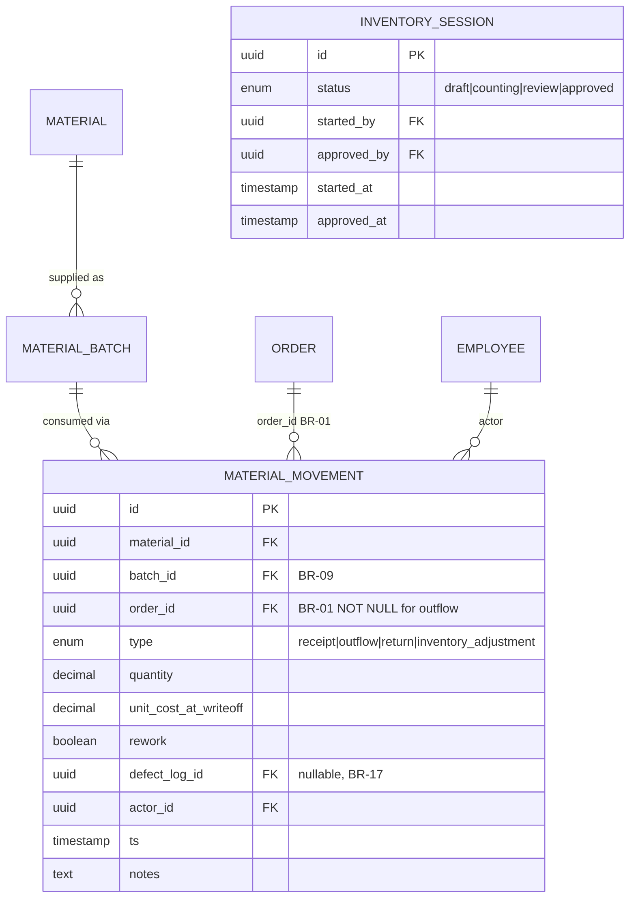

- `Material` см. § 6.4.
- `MaterialBatch`: id, material_id, batch_number, received_at,
  qty_initial, qty_remaining (CHECK ≥ 0), unit_cost, supplier.
- `WarehouseId`: const (`MAIN` для MVP, см. BR — multi-warehouse в FK).

### Бизнес-инварианты

- **BR-01** Списание только на заказ.
- **BR-09** FIFO.
- **BR-16** Инвентаризация — отдельный workflow.
- **BR-14** Поступление только складщиком/админом, через справочник.

### Статус-машина (InventorySession)

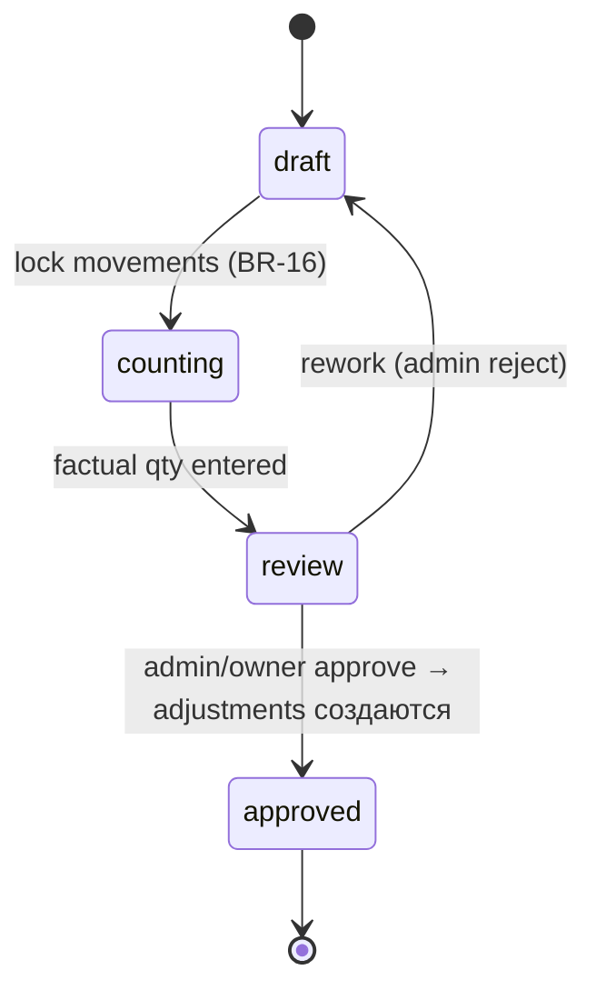

### Права по ролям

| Действие | Складщик | Админ | Производство | Owner |
| --- | --- | --- | --- | --- |
| Receipt | ● | ● | — | — |
| Outflow (BR-01) | ● | ● | — | — |
| Return | ● | ● | — | — |
| Start inventory | ● | ● | — | — |
| Approve inventory | — | ● | — | ● |

### API endpoints

```
GET    /api/v1/warehouse/stock?material_id=
POST   /api/v1/warehouse/receipts
POST   /api/v1/warehouse/writeoffs           (требует order_id, BR-01)
POST   /api/v1/warehouse/returns
POST   /api/v1/warehouse/inventory/sessions
POST   /api/v1/warehouse/inventory/sessions/{id}/finalize
```

### Открытые вопросы / TBD

— MVP one-warehouse, multi в FK на будущее (закреплено 2026-05-05).

---

## 6.12 — Брак (Контроль качества)

**Назначение:** фиксация брака исключительно складщиком.
**Источник в ТЗ:** § 6.12, § 5.1.1.13, § 4.1.
**Backend mapping:** `apps/defects`.

### Модель данных

- `DefectLog`: id, order_id, recorded_by (FK employee), quantity,
  stage (`design | production | material | post_production`),
  responsible_employee_id (suspected), photo_s3_keys[], description, ts.
- `DefectPhoto`: id, defect_log_id, s3_key, taken_at.

### Бизнес-инварианты

- **BR-03** Только складщик.
- **BR-13** История неизменяема.
- **BR-17** Триггер повторного производства.

### Права по ролям

| Действие | Складщик | Админ | Производство |
| --- | --- | --- | --- |
| Record defect | ● | ● | — |
| Add photo | ● | ● | — |
| Update | ● (только свои до 24h) | ● | — |
| View | ● | ● | ●(своих заказов) |

### API endpoints

```
POST   /api/v1/defects
POST   /api/v1/defects/{id}/photos        (presigned S3)
GET    /api/v1/orders/{id}/defects
POST   /api/v1/defects/{id}/initiate-rework
```

---

## 6.13 — Повторное производство (Rework)

**Назначение:** создание задач переделки + повторное списание материалов.
**Источник в ТЗ:** § 6.13, § 5.1.1.14.
**Backend mapping:** внутри `apps/defects` или отдельно.

### Модель данных

- `ReworkTask`: id, defect_log_id, original_order_id, new_production_tasks[],
  status (`pending | in_progress | done`), created_by (warehouse_keeper),
  created_at.

### Бизнес-инварианты

- **BR-17** Повторное списание материалов с rework_flag.

### API endpoints

```
POST   /api/v1/rework  (тригерится из defect → 6.12)
GET    /api/v1/orders/{id}/reworks
```

---

## Часть IV — Продажи и кабинет (6.14 – 6.15)

## 6.14 — Продажа товара

**Назначение:** упрощённый флоу для типа заказа `goods` — проверка
наличия → оплата → выдача.
**Источник в ТЗ:** § 6.14, § 5.1.3.
**Backend mapping:** `apps/goods_sales` (внутри `apps/orders`).

### Модель данных

- `GoodsOrder` (специализация Order с type=goods).
- `GoodsStockMovement`: уменьшение `goods.stock` при confirm заказа.

### Бизнес-инварианты

- **BR-23** Атомарное уменьшение stock при confirm.
- **BR-30** Sync с payment.
- **BR-36** Чек 54-ФЗ для B2C.

### Статус-машина

```
draft → confirmed (stock--) → paid (BR-30) → handed_over → completed
                                 ↓
                              refunded (stock++)
```

### Права по ролям

| Действие | Менеджер | Кассир (= админ) | Клиент |
| --- | --- | --- | --- |
| Create | ● | ● | ●(self) |
| Confirm | ● | ● | — |
| Hand over | ● | ● | — |
| Refund | — | ● | — |

### API endpoints

```
POST   /api/v1/orders                       (type=goods)
POST   /api/v1/orders/{id}/confirm          (BR-23)
POST   /api/v1/orders/{id}/handover
POST   /api/v1/orders/{id}/refund           (admin)
```

### Открытые вопросы / TBD

- Эквайринг — TBD после 🔴 Q5; ОФД-провайдер — под-блокер от Q5.

---

## 6.15 — Клиентский кабинет

**Назначение:** внешний интерфейс для клиента (PWA web): создание
заказа, просмотр статуса, согласование макетов, документы, оплата.
**Источник в ТЗ:** § 6.15, § 1.4.
**Backend mapping:** `apps/client_portal` (frontend `prototype/apps/client-portal`).

### Модель данных

— использует `orders`, `clients`, `documents`, `payments`,
`design_reviews`, `notifications`. Ничего своего.

### Бизнес-инварианты

- **BR-32** Read-only для чужих данных; нет cost-breakdown для клиента.
- **BR-13** Approve macet записывается в audit_log.
- **BR-25** Документы доступны на скачивание.

### Авторизация

- **SMS-код** (без Telegram) + **email magic-link** параллельно
  (закреплено 2026-05-05).

### Функции

| Раздел | Действия |
| --- | --- |
| Заказы | список, детали, status timeline |
| Новый заказ | wizard: тип → услуга → параметры → цена → подтверждение |
| Макеты | preview, approve / reject + comment |
| Документы | счёт, акт, договор-оферта (download PDF) |
| Оплата | онлайн через эквайринг (TBD Q5) или счёт для B2B |
| Профиль | контакты, адреса |

### API endpoints (клиентские)

```
POST   /api/v1/portal/auth/sms-code
POST   /api/v1/portal/auth/email-magic-link
GET    /api/v1/portal/orders
POST   /api/v1/portal/orders                (с предварительным расчётом)
GET    /api/v1/portal/orders/{id}/documents
POST   /api/v1/portal/orders/{id}/approve-design
GET    /api/v1/portal/orders/{id}/payment-link
```

### Открытые вопросы / TBD

- Эквайринг — TBD после 🔴 Q5.

---

## Часть V — Прочее (6.16 – 6.22)

## 6.16 — Уведомления и задачи

**Назначение:** провайдер-абстракция для всех уведомлений системы.
**Каналы (закреплено 2026-05-05):** WebPush → SMS → Email.
**Telegram НЕ используется как продуктовый канал.**
**Источник в ТЗ:** § 6.16. Продуктовое решение от 2026-05-05.
**Backend mapping:** `apps/notifications`.

### Модель данных

- `NotificationTemplate`: id, code (`order_status_changed`,
  `aftercare_due`, `equipment_to_required` ...), title, body_template,
  channels[], severity.
- `NotificationPreference`: user_id, channel, enabled, do_not_disturb.
- `NotificationDelivery`: id, user_id, template_id, channel,
  payload, status (`queued | sent | delivered | failed`), provider_response, ts.

### Бизнес-инварианты

- **BR-24** Без Telegram-провайдера; fallback-цепочка WebPush → SMS → Email.
- **BR-29** Триггер уведомления о ТО оборудования.
- **BR-12** Триггер followup-задачи.

### Архитектура каналов

```
Sender (любой apps/*)
   ↓
NotificationService.send(user_id, template, data)
   ↓
ChannelRouter (по prefs + fallback)
   ↓
[WebPushProvider] [SMSProvider] [EmailProvider]
                   (TBD vendor)   (TBD vendor)
```

### API endpoints

```
GET    /api/v1/notifications/me?status=
POST   /api/v1/notifications/me/preferences
POST   /api/v1/notifications/{id}/mark-read
```

### Открытые вопросы / TBD

- SMS-провайдер (SMSAero / MTS Exolve) — 🟡 после выбора владельцем.
- Email-провайдер (Unisender Go / SendGrid) — 🟡.
- WebPush keys — генерируются при деплое.

---

## 6.17 — Постобслуживание клиентов

**Назначение:** контроль качества сервиса через звонки клиенту через
1–2 дня после завершения заказа.
**Источник в ТЗ:** § 6.17, § 5.2.3.
**Backend mapping:** `apps/aftercare`.

### Модель данных

- `AftercareTask`: id, order_id, assignee_id (manager), due_at,
  status (`pending | in_progress | done | overdue`),
  rating (1..5, NOT NULL on done), comment, completed_at.

### Бизнес-инварианты

- **BR-12** Создание автоматом + обязательный rating.

### Статус-машина

```
pending → in_progress → done (rating + comment required)
       → overdue (background job по due_at < now)
```

### Права по ролям

| Действие | Менеджер | Колл-центр (будущее) | Админ |
| --- | --- | --- | --- |
| Pickup | ● | ● | ● |
| Complete | ● | ● | ● |
| Reassign | — | — | ● |

### API endpoints

```
GET    /api/v1/aftercare/tasks?status=
POST   /api/v1/aftercare/tasks/{id}/complete  (rating + comment)
```

---

## 6.18 — Аналитика и отчёты

**Назначение:** дашборды и отчёты для руководства.
**Источник в ТЗ:** § 6.18, § 7.13, § 7.14.
**Backend mapping:** `apps/analytics`.

### Виды отчётов

| Отчёт | Источники | Получатели |
| --- | --- | --- |
| P&L по периоду | orders, payments, payroll, equipment depreciation | Owner, CFO |
| Рейтинг сотрудников KPI | daily_employee_stat | Owner, Production Lead |
| Загрузка склада | material_movements, batches | Складщик, Owner |
| Брак и потери | defect_log, rework | Owner, Production Lead |
| Lead-time по этапам | order_status_log | Owner |
| Конверсия лидов | leads | Менеджеры, Owner |

### Бизнес-инварианты

- **BR-19** Группировка по accrual_period.
- **BR-32** Клиент не видит cost-данные.

### API endpoints

```
GET    /api/v1/analytics/pnl?period=
GET    /api/v1/analytics/kpi-leaderboard?period=
GET    /api/v1/analytics/lead-funnel?period=
GET    /api/v1/analytics/defect-loss?period=
```

### Открытые вопросы / TBD

- Метрика налогов — TBD после 🔴 Q1.

---

## 6.19 — Управление пользователями и ролями

**Назначение:** auth + RBAC.
**Источник в ТЗ:** § 6.19, § 8.1, § 8.2.
**Backend mapping:** `apps/users`.

### Модель данных

- `User`: id, phone, password_hash, email, last_login_at, locked_until,
  failed_attempts.
- `Employee`: id, user_id, full_name, role(s) (`manager | designer | production_*
  | warehouse_keeper | admin | owner | client | driver | installer | print_op | laser_op
  | wood_op | shop_lead`), department, hired_at, active.
- `Role`: id, code, permissions (json).
- `Permission`: enumerated (orders.create, defects.create, services.edit ...).

### Роли (из ТЗ § 4 + § 8.2)

- **Складщик** (warehouse_keeper)
- **Производство** — общая, специализация: печатник, лазерщик, плотник,
  монтажник, полиграфист
- **Менеджер** (выездной / офисный)
- **Дизайнер**
- **Production Lead** (руководитель цеха)
- **Администратор** (admin)
- **Руководитель / Owner** (read-only)
- **Клиент**
- **Водитель** (для логистики 6.24)
- **Монтажник** (= производство со специализацией)

### Бизнес-инварианты

- **BR-13** История изменений.
- **BR-14** Изменения ролей admin'ом + audit.

### API endpoints

```
POST   /api/v1/auth/login
POST   /api/v1/auth/logout
POST   /api/v1/auth/refresh
POST   /api/v1/auth/password-reset
GET    /api/v1/users
POST   /api/v1/users                 (admin)
PATCH  /api/v1/users/{id}/roles      (admin)
```

---

## 6.20 — Face Control

**Назначение:** интеграция с системой контроля присутствия по лицу;
адаптер с провайдер-абстракцией.
**Источник в ТЗ:** § 6.20, § 3.2.6.
**Backend mapping:** `apps/face_control` (+ `face_control_adapter`).

### Модель данных

- `FaceControlEvent`: id, employee_id, event_type (`entry | exit`),
  ts, source (`vendor_X`), confidence, raw_payload (json) —
  **append-only**.
- `FaceControlTemplate`: id, employee_id, **consent_id (FK NOT NULL,
  BR-21)**, template_blob (encrypted at rest), created_at, revoked_at.
- `BiometryConsent`: id, employee_id, signed_at, policy_version_hash,
  document_s3_key, ip, revoked_at.
- `AttendanceAdjustment`: id, original_event_id, requested_change,
  reason, status, approved_by, approved_at — workflow корректировки
  (BR-06).

### Архитектура

```
[Vendor SDK / RTSP / Webhook]
        ↓
[face_control_adapter] (провайдер: Hikvision | Suprema | NtechLab | ...)
        ↓
ingest endpoint (service-account only)
        ↓
FaceControlEvent (append-only)
        ↓
[apps/workload + apps/payroll consumers]
```

### Бизнес-инварианты

- **BR-06** События read-only.
- **BR-21** Согласие обязательно для шаблона.
- **BR-22** Базис для расчёта простоев.
- **BR-28** Опоздания / уходы.

### Права по ролям

| Действие | Service-account | Сотрудник | Production Lead | Админ |
| --- | --- | --- | --- | --- |
| Push events | ● | — | — | — |
| View own events | — | ● | — | ● |
| Request adjustment | — | ● | — | — |
| Approve adjustment | — | — | ● | ● |
| Read template | — | — | — | — (service only) |

### API endpoints

```
POST   /api/v1/integrations/face-control/events     (service-account)
GET    /api/v1/face-control/events?employee=&date=
POST   /api/v1/face-control/biometry-consents       (employee)
POST   /api/v1/face-control/biometry-consents/{id}/revoke
POST   /api/v1/face-control/adjustments
POST   /api/v1/face-control/adjustments/{id}/approve
```

### Открытые вопросы / TBD

- **Vendor TBD после 🔴 Q2** (Hikvision / Suprema / NtechLab /
  самописный CV) — см. `Docs/onboarding/owner-questions.md § Q2` +
  ADR-0002.
- Хранение биометрических шаблонов — KMS-ключ зависит от хостинга
  (🔴 Q3).

---

## 6.21 — KPI

**Назначение:** расчёт и визуализация эффективности сотрудников
для рейтинга и сдельной ЗП.
**Источник в ТЗ:** § 6.21, § 7.8.
**Backend mapping:** часть `apps/workload`.

### Модель данных

- `EmployeeKPI`: employee_id, period (month), planned_minutes,
  actual_minutes, output_units, defect_count, kpi_pct, ranking.
- См. также `DailyEmployeeStat` (6.9).

### Формула

```
KPI(%) = (Норма / Факт) × 100
   где Норма = sum(operation.norm_time × output_qty)
       Факт  = sum(operation_log.duration_minutes)
```

### Бизнес-инварианты

- **BR-22** Использует face_control + time_tracking.
- **BR-31** Используется в payroll для процентной формулы.

### API endpoints

```
GET    /api/v1/kpi/employees/{id}?period=
GET    /api/v1/kpi/leaderboard?period=
```

---

## 6.22 — Сдельная ЗП и баланс сотрудника

**Назначение:** расчёт ЗП по двойной формуле + баланс «выплачено −
заработано» с долговой моделью.
**Источник в ТЗ:** § 6.22, § 7.6 – 7.10, § 7.12, § 7.15.
**Backend mapping:** `apps/payroll`.

### Модель данных

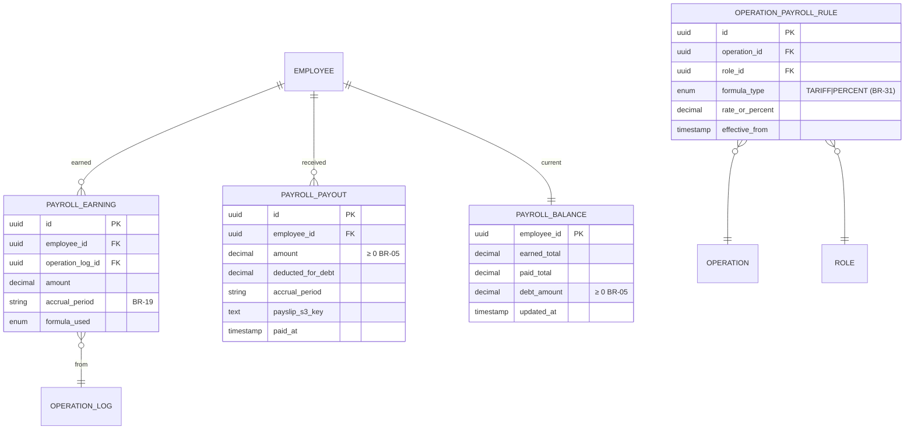

### Бизнес-инварианты

- **BR-05** Долговой баланс как займ; ст. 137 ТК — удержание ≤ 20%.
- **BR-13** Полная история начислений и выплат.
- **BR-19** accrual_period обязателен.
- **BR-31** Двойная формула (тариф / процент) per operation × role.
- **BR-36** Расчётный лист генерируется на каждую выплату (ТК ст. 136).

### Workflow

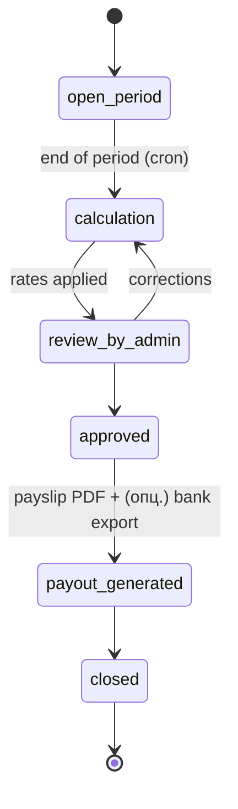

### Права по ролям

| Действие | Сотрудник | Админ | Owner |
| --- | --- | --- | --- |
| View own balance / payslip | ● | ● | ● |
| Edit operation_payroll_rule | — | ● | — |
| Approve period | — | ● | ●(co-sign) |
| Modify earnings | — | — | — |

### API endpoints

```
GET    /api/v1/payroll/balance/me
GET    /api/v1/payroll/payslips/me?period=
GET    /api/v1/payroll/periods?status=
POST   /api/v1/payroll/periods/{id}/calculate
POST   /api/v1/payroll/periods/{id}/approve     (admin)
GET    /api/v1/payroll/payslips/{id}.pdf
POST   /api/v1/payroll/rules                    (admin, BR-31)
```

### Открытые вопросы / TBD

- Конкретный MIN_WAGE и периодичность (месяц / 2 нед.) — 🟡 уточнение
  владельца.
- Налоги с ЗП — TBD после 🔴 Q1 (юрисдикция / СНО).

---

## Часть VI — Дополнение (6.23 – 6.25)

## 6.23 — Документооборот

**Назначение:** автоматическая генерация PDF-документов (счёт /
договор-оферта / акт / ТТН) + хранение архива по контрагенту.
**Источник в ТЗ:** § 6.23 (`tz-dop-modules.md`).
**Backend mapping:** `apps/docflow`.

### Модель данных

- `DocumentTemplate`: id, code (`invoice | contract | act | ttn |
  payslip | inventory_act`), version, body_template (jinja),
  active_from, active_until, created_by_admin.
- `Document`: id, order_id (or counterparty_id), template_id,
  template_version, **s3_key (Yandex Object Storage, UNIQUE)**,
  status (`draft | finalized`), generated_at,
  **retention_until** (created_at + 5 лет, 402-ФЗ),
  signed_by_company, signed_by_counterparty.

### Бизнес-инварианты

- **BR-25** Без ручной правки; все доки из шаблонов.
- **BR-13** История версий шаблонов.

### Документы по типам заказа

| Документ | workshop | office | goods | Когда |
| --- | --- | --- | --- | --- |
| Счёт | ● | ● | ●(B2B) | при confirm |
| Договор-оферта | ● | (опц) | — | при confirm |
| Акт | ● | (опц) | — | при completed |
| ТТН | ●(если delivery) | — | ●(если delivery) | при handover |
| Расчётный лист (для сотрудника) | — | — | — | каждую выплату |
| Чек 54-ФЗ (B2C) | через `apps/fiscal` | через `apps/fiscal` | через `apps/fiscal` | при оплате B2C |

### Права по ролям

| Действие | Менеджер | Админ | Клиент |
| --- | --- | --- | --- |
| Generate (manual) | ● | ● | — |
| View / download | ●(своих) | ● | ●(своих) |
| Edit template | — | ● | — |

### API endpoints

```
POST   /api/v1/orders/{id}/documents      (template_code)
GET    /api/v1/orders/{id}/documents
GET    /api/v1/documents/{id}/download
GET    /api/v1/portal/orders/{id}/documents     (client view)
POST   /api/v1/document-templates                (admin)
```

### Открытые вопросы / TBD

- ЭДО (Контур.Диадок / СБИС) — фаза 2+, не в MVP.
- Чеки 54-ФЗ — отдельный модуль `apps/fiscal`, провайдер ОФД TBD после
  🔴 Q5 (под-блокер от Q14).

---

## 6.24 — Логистика

**Назначение:** назначение водителей / монтажников, расчёт стоимости
доставки через Yandex Maps, статусы «В пути / На монтаже».
**Источник в ТЗ:** § 6.24, § 7.18.
**Backend mapping:** `apps/logistics`.

### Модель данных

- `LogisticsAssignment`: id, order_id, driver_id (или installer_id),
  vehicle_id, scheduled_at, address, distance_km, eta_minutes,
  status (`scheduled | en_route | on_site | done | failed`),
  actual_start, actual_end.
- `Vehicle`: id, license_plate, model, fuel_consumption_per_100km,
  cost_value, lifetime_km, cost_per_km_amortization.
- `LogisticsCost`: id, order_id, fuel_cost, vehicle_amortization,
  driver_time_cost, total.

### Бизнес-инварианты

- **BR-26** Формула § 7.18 + Yandex Maps API.

### Статус-машина

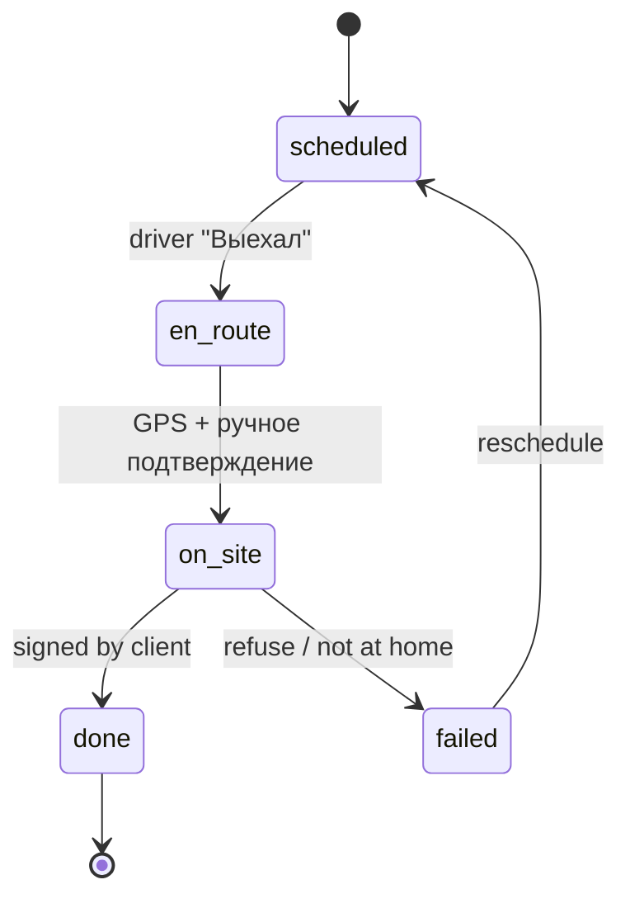

### Интеграция

- **Yandex Maps Routing API** (закреплено 2026-05-05) — расчёт
  расстояния и времени; ручной fallback при недоступности.
- GPS трек водителя (опционально, через PWA геолокацию).

### Права по ролям

| Действие | Менеджер | Водитель / Монтажник | Админ |
| --- | --- | --- | --- |
| Schedule | ● | — | ● |
| Update status | — | ● (свои) | ● |
| Compute logistics cost | (auto) | — | ● (override) |

### API endpoints

```
POST   /api/v1/logistics/assignments
PATCH  /api/v1/logistics/assignments/{id}/status
GET    /api/v1/logistics/assignments?driver=&date=
POST   /api/v1/logistics/distance-quote   (через Yandex Maps)
```

### Открытые вопросы / TBD

- Тарифы ГСМ / амортизации авто / ставка водителя — 🟡 владелец.

---

## 6.25 — Мониторинг оборудования

**Назначение:** учёт наработки часов / м.п. для каждого станка +
автоматические уведомления о ТО.
**Источник в ТЗ:** § 6.25, § 7.17.
**Backend mapping:** `apps/equipment`.

### Модель данных

- `Equipment`: id, name, type (`printer | laser | plotter | router`),
  cost_total, lifetime_hours (nullable), lifetime_meters (nullable),
  maintenance_threshold_hours, maintenance_threshold_meters,
  cumulative_usage_hours, cumulative_usage_meters,
  last_maintenance_at, status (`OK | WARNING | MAINTENANCE_REQUIRED`).
- `EquipmentUsage`: id, equipment_id, operation_log_id, duration_hours,
  meters_used, ts.
- `MaintenanceTask`: id, equipment_id, scheduled_at, performed_at,
  performed_by, notes, status.

### Бизнес-инварианты

- **BR-18** Амортизация в себестоимости.
- **BR-29** Уведомление о ТО при пороге.

### Статус-машина (Equipment)

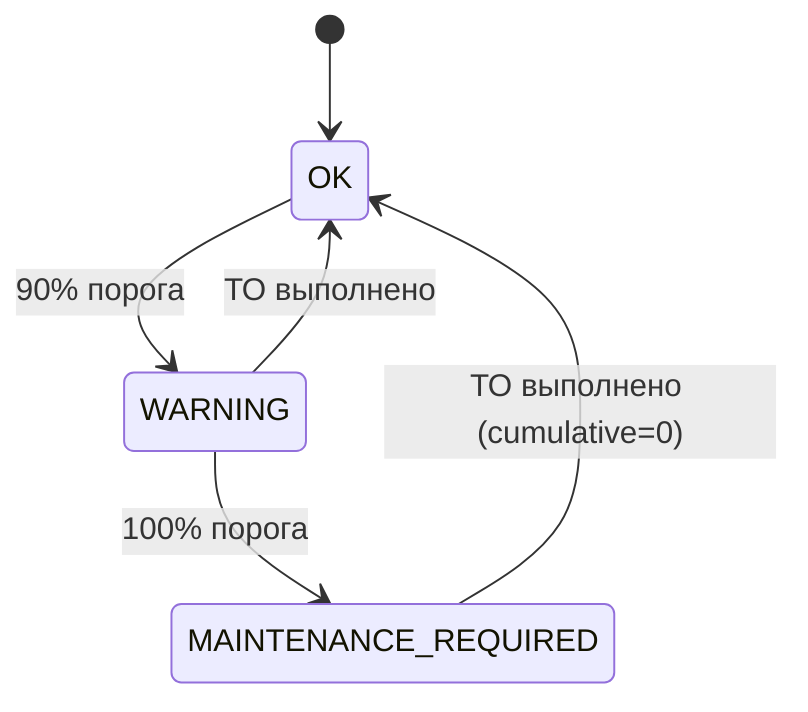

### API endpoints

```
GET    /api/v1/equipment
POST   /api/v1/equipment/{id}/maintenance       (admin closes ТО)
GET    /api/v1/equipment/{id}/usage?period=
GET    /api/v1/equipment/{id}/depreciation?period=
```

---

## Часть VII — Расчёты § 7

### 7.1 Стоимость заказа для клиента

**Формула:**
```
Цена = Σ(item.unit_price × item.quantity)
     + Логистика (если delivery)        // BR-26 / 6.24
     + Налоги                            // BR-27 / TBD Q1
     − Скидки клиента                    // если есть
```
**Owner:** менеджер при создании / клиент в кабинете (preview).
**Пример:** баннер 10 м² × 800 ₽/м² = 8000 ₽; + доставка 1500 ₽; +
НДС 20% = 1900 ₽; итого 11400 ₽.

### 7.2 Расход материалов (план)

**Формула:**
```
Расход_мат = Σ(item.quantity × norm_rate(material_per_unit))
```
**Owner:** автомат при создании заказа; складщик корректирует факт.

### 7.3 Норма времени (план)

```
Плановое_время = Σ(item.quantity × norm_rate(time_per_unit))
```

### 7.4 Учёт фактического времени

```
Фактическое_время = Σ(operation_log.duration_minutes)
```
Источник: кнопки «Начать / Завершить».

### 7.5 Сравнение план vs факт

```
Δ_время = Факт − План
Δ_материал = Σ(material_movement.quantity) − План_материала
```
- Δ > 0 → перерасход / низкая эффективность.
- Δ < 0 → экономия / высокая эффективность.

### 7.6 Загрузка сотрудников

```
Загрузка(%) = (Рабочее_время / Время_присутствия) × 100
   где Время_присутствия = sum(face_control intervals)
       Рабочее_время = sum(operation_log)
```
**Owner:** автомат, дашборд директора.

### 7.7 Простой сотрудника

```
Простой = Время_присутствия − Рабочее_время
```
(BR-22). Threshold для флага — настраиваемый.

### 7.8 Эффективность (KPI)

```
KPI(%) = (Норма / Факт) × 100
```
> 100% — переработал план; < 100% — отстаёт.

### 7.9 Себестоимость заказа

```
Себестоимость = Σ(material_movement.quantity × unit_cost_at_writeoff)   // BR-09 FIFO
              + Σ(operation_log.duration × payroll_rate)                  // BR-31
              + Σ(equipment_depreciation)                                 // BR-18 / 6.25
              + Σ(rework_cost)                                            // BR-17
              + Σ(logistics_cost)                                         // BR-26
              + Накладные расходы (% или fixed)
```
**Owner:** автомат на стороне `apps/analytics` после complete.

### 7.10 Перерасход материалов

```
Перерасход = Факт − Норма
   где Факт = Σ(material_movement)
       Норма = Σ(item.quantity × norm_rate(material_per_unit))
```
Перерасход > N% — алерт production_lead.

### 7.11 Брак и потери

```
Стоимость_брака = Σ(rework material_movement × unit_cost)
                + Стоимость_времени_переделки
                + Стоимость_оборудования_переделки
```
Учитывается как «прямые потери» в P&L.

### 7.12 Заработная плата (двойная формула)

**Тарифная (TARIFF):**
```
Earned = rate_per_unit × output_quantity
```
**Процентная (PERCENT):**
```
Earned = client_cost × percent / 100
   где client_cost — стоимость операции / услуги для клиента
```
Выбор формулы фиксирован в `OperationPayrollRule(operation, role)` —
**BR-31, закреплено 2026-05-05**. Bonus / штраф / надбавки — отдельно.

### 7.13 Прибыль по заказу

```
Прибыль = Выручка − Себестоимость − Налоги
   где Выручка из payments,
       Себестоимость по 7.9,
       Налоги по 7.16.
```
**Owner:** Owner / CFO (через `apps/analytics`).

### 7.14 Финансовая аналитика

— агрегации по `accrual_period` (BR-19): выручка, себестоимость,
прибыль, ЗП, амортизация, логистика, налоги. См. § 6.18.

### 7.15 Баланс сотрудника (с долгом-займом)

```
Balance = Σ(payouts) − Σ(earnings)
```
- Если earned < MIN_WAGE: payout = MIN_WAGE; debt += (MIN_WAGE − earned).
- Если earned ≥ MIN_WAGE: payout = earned − min(debt, earned × 0.20);
  debt -= deducted.
- Всегда `payout ≥ 0` и удержание ≤ 20% (ст. 137 ТК — BR-05).

**Пример из ТЗ:**
- Месяц 1: earned 1.8 М, MIN_WAGE = 3 М → payout 3 М, debt = 1.2 М.
- Месяц 2: earned 5 М, debt 1.2 М → удержание min(1.2, 5×0.20)=1 М,
  payout = 5 − 1 = 4 М, debt = 0.2 М. (В ТЗ оригинальный пример без
  ограничения 20%; реализуем с ограничением для соответствия ТК ст. 137.)

### 7.16 Налоги

**Формула:**
```
Налог_к_цене = Цена × tax_rate(СНО)
   ОСН: НДС 20% → отдельной строкой;
   УСН (доходы): 6% — учитывается в P&L, не в цене;
   УСН (доходы−расходы): 15% — учитывается в P&L.
```
**TBD после 🔴 Q1** (юрисдикция и СНО) — см.
`Docs/onboarding/owner-questions.md § Q1`.

### 7.17 Амортизация оборудования

```
Depreciation_op = (cost_total / lifetime_hours) × duration_hours
                  ИЛИ
                  (cost_total / lifetime_meters) × meters_used
```
Включается в себестоимость заказа (BR-18). См. § 6.25.

### 7.18 Логистика

```
Логистика = ГСМ_цена_за_л × расход_л_на_100км × distance_km / 100
          + cost_per_km_amortization × distance_km
          + driver_hourly_rate × duration_hours
```
Расстояние и время — через **Yandex Maps Routing API** (BR-26,
закреплено 2026-05-05).

---

## Часть VIII — Cross-module flows

### Flow A: Полный заказ цеха (workshop) — happy path

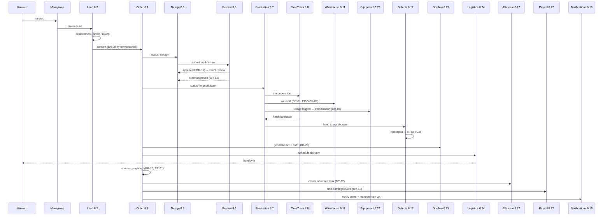

### Flow B: Расчёт ЗП за период

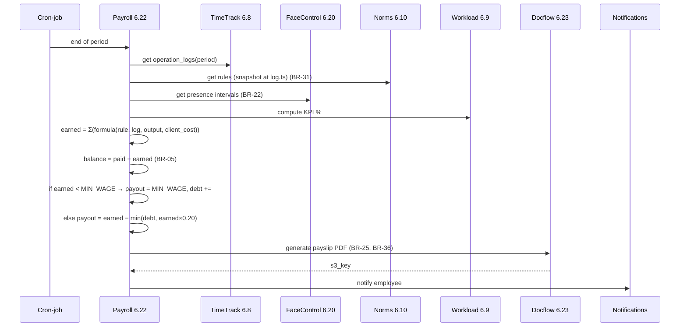

### Flow C: Выявление брака → переделка

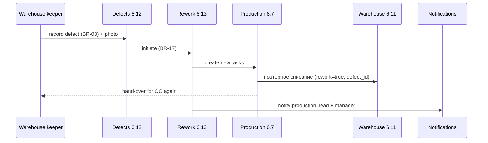

---

## Эволюция документа

| Триггер | Что обновить |
| --- | --- |
| Появилось новое BR | Добавить ссылку в раздел «Бизнес-инварианты» соответствующего модуля + матрицу в `BUSINESS_RULES.md` |
| Закрылся 🔴 Q1–Q5 | Снять TBD-маркеры и заменить на ADR-ссылку |
| Добавился модуль | Новая секция + обновление карты модулей и `apps/*` маппинга |
| Изменился расчёт § 7 | Раздел «Часть VII» + при необходимости BR в `BUSINESS_RULES.md` |
| Изменилась статус-машина | Mermaid `stateDiagram` + затронутые BR |

История изменений — в `Docs/log.md` (правило **B** из CLAUDE.md).

## История изменений

| Дата | Кто | Что |
| --- | --- | --- |
| 2026-05-05 | PM (Claude) | Initial draft: модули 6.1–6.25 + расчёты § 7.1–7.18 + cross-module flows; зафиксированы решения owner от 2026-05-05 (PWA / Yandex Maps / Yandex Object Storage / без Telegram-продукта / B2B+B2C → ОФД / двойная формула ЗП / one-warehouse MVP) |
