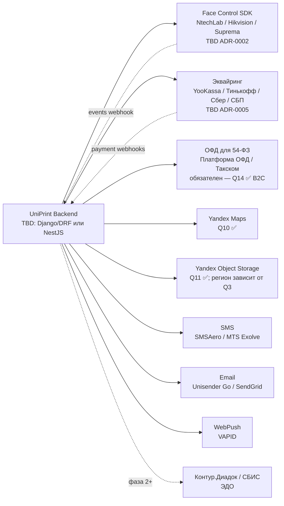

# 05 · Внешние интеграции UniPrint

> **Статус:** СКЕЛЕТ (обновлено 2026-05-05 после ответов клиента —
> 14/20 закрыто). Phase-0 (прототип на моках). Открытые 🔴 — Q1, Q2,
> Q3, Q4, Q5. Финал по vendor'ам — ADR-0002 (Face Control), ADR-0003
> (хостинг), ADR-0005 (эквайринг + ОФД).
>
> **Закреплено:** карты = Yandex Maps; хранилище макетов = Yandex
> Object Storage; Telegram **исключён из продукта** (Q7 ✅) — раздел §8
> ниже сохранён только как историческая справка/архив.
> Эквайринг + ОФД (Q14 ✅ микс B2B+B2C) — ОФД обязателен.
>
> **Назначение документа:** показать, **что мы интегрируем**, **с кем
> возможны интеграции** (TBD), и **как устроена абстракция** —
> чтобы прототип не зависел от выбора vendor'а.
>
> **Связанные документы:**
> - `Docs/03-architecture.md` § 9 — провайдер-абстракции
> - `Docs/09-compliance.md` § 152-ФЗ ст. 11 — биометрия
> - `Docs/onboarding/owner-questions.md` — 🔴 #2, #3, #5, #7
> - ADR'ы (после 🔴): `Docs/adr/0002 / 0003 / 0005`

---

## Содержание

1. [Карта внешних интеграций](#1-карта-внешних-интеграций)
2. [Принципы](#2-принципы)
3. [Face Control](#3-face-control)
4. [Эквайринг](#4-эквайринг)
5. [ОФД (54-ФЗ)](#5-офд-54-фз)
6. [Карты (логистика)](#6-карты-логистика)
7. [S3-объектное хранилище для макетов](#7-s3-объектное-хранилище-для-макетов)
8. [Telegram Bot](#8-telegram-bot)
9. [SMS](#9-sms)
10. [Email](#10-email)
11. [Бухгалтерия / ЭДО (фаза 2+)](#11-бухгалтерия--эдо-фаза-2)
12. [Стратегия каналов уведомлений](#12-стратегия-каналов-уведомлений)
13. [Mock-стратегия для прототипа](#13-mock-стратегия-для-прототипа)
14. [Открытые вопросы (TBD)](#14-открытые-вопросы-tbd)

---

## 1. Карта внешних интеграций



---

## 2. Принципы

1. **Provider-абстракция везде.** Каждая интеграция — за `interface`,
   ≥1 mock-impl + ≥1 real-impl. Подмена vendor'а = swap impl, не UI.
2. **Все секреты — в `.env*` / secrets vault** (Yandex Lockbox / Vault —
   TBD после ADR-0003). В репо — только `.env.example`.
3. **Webhooks — idempotent.** Каждый webhook обрабатывается с
   idempotency key для защиты от retries vendor'а.
4. **Audit-log на интеграции с ПДн** (152-ФЗ): Face Control, эквайринг,
   ОФД, SMS — каждый исходящий запрос с PII логируется.
5. **Фоллбэки.** Каждый канал нотификаций имеет фоллбэк (см. § 12).
6. **Тестирование.** Mock-impl используется в unit/integration тестах;
   sandbox-режим vendor'а (для тех, у кого есть) — в e2e.

---

## 3. Face Control

### 3.1 Назначение

Контроль присутствия сотрудников: фиксация входа / выхода через
распознавание лица; передача событий в `face_control_adapter`
для сравнения с рабочим временем (модули § 6.20, § 7.7).

### 3.2 Текущий статус

`TBD после 🔴 #2 — см. Docs/onboarding/owner-questions.md § Q2`.

**Кандидаты vendor'ов (рекомендация Q2 — NtechLab при РФ-юрисдикции):**

| Vendor | Особенности | Применимость |
| --- | --- | --- |
| **NtechLab FindFace** | РФ-вендор, on-prem развёртывание, нет санкционных рисков, готовый SDK (Python / Java / C++) | Default при РФ |
| **Hikvision DeepInMind** | Если уже стоят Hikvision-камеры — использовать как hardware-источник | Если есть legacy-камеры |
| **Suprema BioStar 2** | Premium, корейский, BioMini SDK | Если premium-сегмент |
| **Самописный CV (OpenCV + InsightFace)** | Дешевле в эксплуатации, дольше в разработке (200–400 ч) | Phase 2+ |

### 3.3 Ключевые operations

```typescript
interface FaceControlProvider {
  // Регистрация шаблона лица сотрудника (сохранение в защищённом storage)
  registerTemplate(employeeId: UUID, photo: Buffer): Promise<TemplateId>;

  // Верификация (live-фото из Mobile App / камеры на проходной → match с шаблоном)
  verify(photo: Buffer): Promise<{ employeeId: UUID; confidence: number } | null>;

  // Удаление шаблона (152-ФЗ ст. 14, право на удаление)
  deleteTemplate(employeeId: UUID): Promise<void>;

  // Подписка на события входа / выхода (push от vendor'а через webhook)
  // — реализуется через webhook endpoint, не отдельный метод
}
```

### 3.4 Ключевые webhooks

```
POST /webhooks/face_control/event
{
  "event_id": "<idempotency_key>",
  "type": "enter" | "exit",
  "employee_id": "<UUID>",
  "timestamp": "2026-05-05T08:30:00+03:00",
  "device_id": "<camera_id>",
  "confidence": 0.94
}
```

**Сохраняется в `face_control_events` (только timestamps + employee +
type), без шаблонов.** Шаблоны хранятся отдельно — в защищённом KMS.

### 3.5 Compliance — критично

- **152-ФЗ ст. 11**: биометрические ПДн = специальная категория →
  **отдельное письменное согласие** сотрудника **до** регистрации
  шаблона.
- Шаблоны храним в защищённом storage: Yandex Lockbox / on-prem KMS
  (TBD ADR-0003).
- Audit-log на каждый `verify` и `registerTemplate`.
- Endpoint `deleteTemplate` обязателен.

См. `Docs/09-compliance.md` § биометрия — детально.

### 3.6 ENV-vars (placeholder)

```bash
FACECTRL_VENDOR=mock|ntechlab|hikvision|suprema
FACECTRL_API_KEY=<vendor key>
FACECTRL_ENDPOINT=<vendor endpoint>
FACECTRL_TEMPLATE_STORAGE=lockbox|kms
FACECTRL_WEBHOOK_SECRET=<HMAC secret для подписи webhooks>
```

### 3.7 Подводные камни

- **Лицензирование SDK** — у каждого vendor'а свои условия (per-camera /
  per-employee / unlimited). Уточнить при выборе.
- **Точность distinguishing** — у NtechLab/Hikvision/Suprema разная;
  тестируем на 5–10 «двойниках» (близкая внешность) перед PoC.
- **Условия съёмки** — освещение, угол камеры; нужен onboarding-гайд
  для устроителя.
- **PII в logs** — никогда не логировать сами фото / шаблоны, только
  hash + employee_id.

---

## 4. Эквайринг

### 4.1 Назначение

Приём оплат от клиентов через клиентский кабинет: банковская карта,
СБП, СберPay (NFR § 9.11). Синхронизация статуса оплаты с производственным
циклом заказа (статус «Оплачен» → запуск в производство).

### 4.2 Текущий статус

`TBD после 🔴 #5 — см. Docs/onboarding/owner-questions.md § Q5`.

**Кандидаты:**

| Vendor | Комиссия | Преимущества | Недостатки |
| --- | --- | --- | --- |
| **YooKassa** | ~2.5–3.5% | СберPay/QR/СБП/карты в одном API, простой SDK | Принадлежит Сбер-группе |
| **Тинькофф Эквайринг** | ~2.7% | Хорош для B2B, мерчант-аккаунт | Требует p/c в Тинькофф (опц.) |
| **Сбер Бизнес Онлайн** | ~2.5% | Если основной банк — Сбер | Менее зрелый API |
| **СБП напрямую** | ~0.4–0.7% | Самый дешёвый | Только перевод, нет авторизации с холдом |
| **Только B2B по р/с** | 0% | Без эквайринга | Нет онлайн-оплат для B2C |

**Default-рекомендация:** YooKassa + СБП через абстракцию + B2B по р/с
параллельно.

### 4.3 Ключевые operations

```typescript
interface PaymentProvider {
  // Создание платежа (получаем URL для редиректа клиента)
  createPayment(input: {
    orderId: UUID;
    amount: Money;
    description: string;
    customerEmail?: string;   // для 54-ФЗ чека
    customerPhone?: string;   // для 54-ФЗ чека
  }): Promise<{ paymentId: string; redirectUrl: string }>;

  // Проверка статуса (на случай если webhook не пришёл)
  getStatus(paymentId: string): Promise<PaymentStatus>;

  // Возврат
  refund(paymentId: string, amount: Money, reason: string): Promise<RefundId>;
}
```

### 4.4 Ключевые webhooks

```
POST /webhooks/payments/<provider>
{
  "event_id": "<idempotency_key>",
  "type": "payment.succeeded" | "payment.canceled" | "refund.succeeded",
  "payment_id": "<provider id>",
  "order_id": "<UUID>",
  "amount": { "value": "10000.00", "currency": "RUB" },
  "timestamp": "..."
}
```

### 4.5 ENV-vars

```bash
PAYMENTS_PROVIDER=mock|yookassa|tinkoff|sber
PAYMENTS_SHOP_ID=<id>
PAYMENTS_API_KEY=<key>
PAYMENTS_WEBHOOK_SECRET=<HMAC>
SBP_MERCHANT_ID=<id>
```

### 4.6 Подводные камни

- **54-ФЗ:** YooKassa требует **email или phone** клиента в платеже —
  это используется для отправки фискального чека через ОФД.
  Если оба отсутствуют — провайдер откажет. См. § 5.
- **Холд + capture:** для крупных B2B-заказов имеет смысл двух-шаговая
  модель (auth + capture) — поддерживается YooKassa / Тинькофф.
- **Чек-возврат для refund:** обязателен (54-ФЗ).
- **Sandbox / live разделение** — отдельные креды, в `.env.example`
  два набора.
- **Webhook-доставка:** vendor может ретраить → idempotency обязателен.

---

## 5. ОФД (54-ФЗ)

### 5.1 Назначение

Печать онлайн-чеков для B2C-оплат через эквайринг (54-ФЗ).
Применимо **только если** есть приём оплат от физических лиц.
Если только B2B по р/с — модуль не нужен.

### 5.2 Текущий статус

`TBD после 🔴 #5 / Q14 — см. Docs/onboarding/owner-questions.md`.

**Кандидаты:**

- **Платформа ОФД** (~1500 ₽/мес, лучший API — рекомендация)
- **Такском**
- **Яндекс ОФД**
- **Первый ОФД**

### 5.3 Ключевые operations

```typescript
interface FiscalProvider {
  emitReceipt(input: {
    orderId: UUID;
    items: Array<{ name: string; quantity: number; price: Money; vat: VatRate }>;
    customerEmail?: string;
    customerPhone?: string;
    paymentMethod: 'card' | 'cash' | 'sbp';
  }): Promise<{ fiscalReceiptId: string; fiscalDocNumber: string }>;

  emitRefund(receiptId: string, items: Item[]): Promise<void>;
}
```

### 5.4 ENV-vars

```bash
OFD_PROVIDER=mock|platforma|taxcom|yandex|first
OFD_API_KEY=<key>
OFD_INN=<ИНН организации>
OFD_KKM_REGISTRATION=<рег. номер ККМ если облачный кассовый аппарат>
```

### 5.5 Подводные камни

- **Каждая кассовая операция** должна породить чек **в течение 30 минут**.
- **Возврат** требует отдельный чек-возврат.
- **Регистрация ККМ** в ФНС — отдельный процесс, не code-side.
- **Если только B2B по р/с** — `FiscalProvider` остаётся `MockFiscal`
  (no-op), модуль не активен.

---

## 6. Карты (логистика)

### 6.1 Назначение

Геокодирование адресов клиентов и точек монтажа, расчёт маршрутов
для доставки и выезда монтажников, расчёт стоимости логистики
(модули § 6.24, § 7.18).

### 6.2 Текущий статус

`TBD — см. Docs/onboarding/owner-questions.md § Q10`. Default
при РФ-юрисдикции — Yandex Maps API.

| Vendor | Для РФ | Особенности |
| --- | --- | --- |
| **Yandex Maps API** | Да | Лучшая точность по РФ, бесплатный tier 25k req/день |
| **2GIS** | Да | Хорошее покрытие региональных городов, бесплатный tier |
| **Google Maps** | Технически да | Не рекомендуется (санкционные риски с биллингом) |

### 6.3 Ключевые operations

```typescript
interface MapsProvider {
  geocode(address: string): Promise<{ lat: number; lng: number; formatted: string } | null>;
  reverseGeocode(lat: number, lng: number): Promise<string>;
  route(from: Coords, to: Coords): Promise<{ distanceKm: number; durationSec: number; polyline: string }>;
  distance(from: Coords, to: Coords): Promise<number>; // быстрая matrix-операция
}
```

### 6.4 ENV-vars

```bash
MAPS_PROVIDER=mock|yandex|2gis
MAPS_API_KEY=<key>
```

### 6.5 Подводные камни

- **Лимиты бесплатного tier'а** — для production обычно нужен платный.
- **Yandex Maps Platform Lite vs Business** — Lite для встраивания в
  PWA, Business для backend-расчётов; разные ключи.

---

## 7. S3-объектное хранилище для макетов

### 7.1 Назначение

Хранение макетов клиентов (PDF, AI / EPS / CDR, PSD / TIFF, JPG / PNG),
готовых документов (счета / акты / ТТН в PDF), фото фиксации брака.
NFR § 9.10 — гарантированное хранение макетов ≥ 12 месяцев.

### 7.2 Текущий статус

`TBD после 🔴 #3 + Q11 — см. Docs/onboarding/owner-questions.md`.

**Кандидаты (РФ, S3-совместимые):**

- **Yandex Object Storage** — default, ~1 ₽/ГБ/мес, lifecycle policy
- **Selectel S3**
- **VK Cloud Storage**
- **MinIO on-prem** — если хостинг on-prem

### 7.3 Ключевые operations

```typescript
interface StorageProvider {
  // Presigned URL для прямой загрузки клиентом из браузера
  getUploadUrl(key: string, contentType: string, ttlSec: number): Promise<{ url: string; method: 'PUT' }>;

  // Скачивание (signed URL с временным TTL)
  getDownloadUrl(key: string, ttlSec: number): Promise<string>;

  delete(key: string): Promise<void>;

  // Lifecycle: переход в Cold Storage после 90 дней без доступа
  // — настраивается на уровне bucket'а, не code-side
}
```

### 7.4 ENV-vars

```bash
S3_PROVIDER=mock|yandex|selectel|vk|minio
S3_ENDPOINT=<https://storage.yandexcloud.net>
S3_ACCESS_KEY=<key>
S3_SECRET=<secret>
S3_BUCKET=uniprint-prod-designs
S3_REGION=ru-central1
```

### 7.5 Подводные камни

- **Multipart upload** — обязателен для файлов > 100 МБ (PSD / TIFF
  широкоформатной печати могут быть до 2 ГБ).
- **Pre-flight валидация** — на стороне клиента в браузере (припуски,
  разрешение, ICC-профиль) **до** upload'а; экономит трафик и хранилище.
- **Lifecycle policy** — переход в Cold Storage после 90 дней
  без доступа (~×3 экономия).
- **CORS** — нужен setup на bucket'е для прямой загрузки из browser'а.

---

## 8. ~~Telegram Bot~~ — **ИСКЛЮЧЁН ИЗ ПРОДУКТА** (Q7 ✅)

> **Решение от 2026-05-05:** Telegram **не используется** как
> продуктовый канал нотификаций или авторизации. Все нотификации
> идут через **WebPush + SMS + Email** (см. § 9, § 10, § 12 ниже).
> Авторизация клиента — **SMS-код + email magic-link**.
>
> Telegram остаётся только как **PM-канал команда↔владелец** (Q20 ✅:
> «Telegram быстрые + Email формальные»), не часть UniPrint-продукта.
>
> **Причины решения** (по словам владельца): минимизация регуляторных
> рисков (РКН-блокировки) + не размывать набор каналов в MVP.
>
> Эта секция оставлена как историческая справка для будущего пересмотра
> (фаза 3+ при необходимости — например, Telegram Mini App для
> клиентского кабинета или быстрые действия сотрудникам).

---

## 9. SMS

### 9.1 Назначение

Транзакционные SMS: OTP при логине клиента, статус заказа («Готов
к выдаче»), фоллбэк нотификаций при недоступности Telegram / WebPush.

### 9.2 Текущий статус

`TBD — см. Docs/onboarding/owner-questions.md § Q7 (стратегия каналов)`.
**Кандидаты:**

- **SMSAero** (~3.5 ₽/SMS)
- **MTS Exolve** (~3 ₽/SMS, нативная интеграция МТС)
- **Билайн Бизнес**
- **Mango Office** (если уже используется как телефония)

### 9.3 Ключевые operations

```typescript
interface SmsProvider {
  send(phoneE164: string, text: string, opts?: { senderName?: string }): Promise<{ messageId: string; cost: Money }>;
  getStatus(messageId: string): Promise<'queued' | 'sent' | 'delivered' | 'failed'>;
}
```

### 9.4 ENV-vars

```bash
SMS_PROVIDER=mock|smsaero|mts|beeline
SMS_API_KEY=<key>
SMS_SENDER_NAME=UNIPRINT  # буквенный sender (после регистрации)
```

### 9.5 Подводные камни

- **Регистрация буквенного sender'а** — 5–15 рабочих дней для каждого
  оператора (МТС, МегаФон, Билайн, Tele2). До регистрации — числовой
  sender (плохо для бренда).
- **Маркетинговые vs транзакционные SMS** — разные тарифы, разный
  compliance. UniPrint — только **транзакционные**.
- **OTP rate-limit** — защита от brute-force OTP-кодов (1 SMS / минуту
  на номер; 5 / час).
- **Стоимость** — ≈ 3 ₽/SMS × объём в день. Для дешёвых нотификаций
  «Заказ готов» использовать WebPush / Telegram.

---

## 10. Email

### 10.1 Назначение

Транзакционный email: подтверждение заказа, отправка счетов / актов
/ ТТН (вложения PDF), magic-link при логине, восстановление пароля.

### 10.2 Текущий статус

`TBD`. Кандидаты:

- **Unisender Go** (РФ-провайдер, ~0.05 ₽ за письмо)
- **SendGrid** (международный, дороже, но мощный)
- **Mailgun**
- **Mail.ru for Business / Yandex Mail SMTP** (если простой объём)

### 10.3 Ключевые operations

```typescript
interface EmailProvider {
  send(input: {
    to: string;
    subject: string;
    html: string;
    attachments?: Attachment[];
    templateId?: string;     // если шаблоны хранятся у vendor'а
    variables?: Record<string, any>;
  }): Promise<{ messageId: string }>;
}
```

### 10.4 ENV-vars

```bash
EMAIL_PROVIDER=mock|unisender|sendgrid|mailgun
EMAIL_API_KEY=<key>
EMAIL_FROM=noreply@uniprint.<domain>
EMAIL_FROM_NAME=UniPrint
```

### 10.5 Подводные камни

- **SPF / DKIM / DMARC** — нужно настроить DNS перед prod-релизом,
  иначе письма уйдут в спам.
- **Bounce / complaint handling** — vendor должен предоставлять
  webhooks для bounce / spam-complaint, иначе deliverability упадёт.
- **Magic-link** — короткий TTL (15 мин), one-shot, signed JWT.
- **Вложения PDF** > 10 МБ — лучше отдавать как ссылку на signed S3 URL.

---

## 11. Бухгалтерия / ЭДО (фаза 2+)

### 11.1 Назначение

Электронный документооборот для B2B-клиентов: подписание счетов,
актов, ТТН через ЭДО (вместо бумаги).

### 11.2 Текущий статус

`Фаза 2+`. Кандидаты:

- **Контур.Диадок**
- **СБИС**

### 11.3 Когда активировать

При появлении первых B2B-клиентов, требующих ЭДО (обычно крупные
организации). Для MVP — простая генерация PDF + хранение в S3,
без ЭДО (см. Q13 в `owner-questions.md`).

---

## 12. Стратегия каналов уведомлений

### 12.1 Принцип

Все нотификации идут через единый модуль `notifications` (см.
`Docs/03-architecture.md` § 4.2) с провайдер-абстракцией.
**Приоритет каналов и фоллбэк** (Q7 ✅ — без Telegram):

```
WebPush (Service Worker)  ──┐
       ↓ (если нет подписки или fail)
SMS                       ──┤
       ↓ (если phone отсутствует или fail)
Email                     ──┘
```

### 12.2 По типу события

| Событие | Канал (приоритет) |
| --- | --- |
| OTP / magic-link при логине | SMS / Email параллельно |
| Новый заказ принят | WebPush + Email (счёт-оферта вложением) |
| Макет на согласование | WebPush + Email |
| Заказ готов к выдаче | WebPush + SMS (фоллбэк) |
| Сотруднику: новая задача | WebPush (открытое приложение) + SMS (если оффлайн) |
| Сотруднику: расчётный лист | Email (с вложением PDF — обязательно по ТК ст. 136) |
| Уведомление руководителю о браке | WebPush + Email |
| Уведомление администратору о ТО оборудования | Email + WebPush |

### 12.3 Авторизация клиента

Клиентский кабинет поддерживает **параллельно несколько способов входа**
(Q7 ✅ — Telegram Login исключён):

- **SMS-OTP** — основной способ, всегда работает в РФ
- **Email magic-link** — альтернатива для тех, кто не хочет SMS

### 12.4 Feature-flags

```bash
WEBPUSH_ENABLED=true
SMS_ENABLED=true
EMAIL_ENABLED=true
# TELEGRAM_ENABLED — не нужен (Q7 ✅, исключено)
```

---

## 13. Mock-стратегия для прототипа

**Цель:** прототип на Vercel preview работает без реальных vendor'ов,
но UI идентичен production-варианту.

### 13.1 Что мокаем через MSW (HTTP-уровень)

| Интеграция | MSW-handler |
| --- | --- |
| Эквайринг (создание платежа, статус, webhooks) | `packages/mocks/handlers/payments.ts` |
| Карты (geocode / route) | `packages/mocks/handlers/maps.ts` (фиксированные координаты по нескольким адресам) |
| S3 (presigned URL + upload) | `packages/mocks/handlers/storage.ts` (URL → in-memory blob) |
| SMS (send) | `packages/mocks/handlers/sms.ts` (логирует в console + UI-toast) |
| Email | `packages/mocks/handlers/email.ts` (UI-preview окно «Letter sent») |

### 13.2 Что мокаем UI-стабами (без HTTP)

| Интеграция | Стратегия |
| --- | --- |
| Face Control события | Таймер-генератор в `mocks/face-control.ts` (каждые 30 сек на dev — фейк-событие enter / exit для случайного сотрудника) |
| Эквайринг UI | Кнопка «Оплатить» → fake-redirect → возврат с фейк-success в течение 3 сек |
| Telegram авторизация | Fake widget → mock JWT с user_id |
| OTP по SMS | Fixed code `0000` для dev/preview |

### 13.3 Mock-notice

В прототипе на старте — `prototype/MOCK_NOTICE.txt` фиксирует:
- Все vendor'ы — mock'и.
- Реальные ПДн запрещены к вводу.
- Vercel — preview hosting, не для production.

---

## 14. Открытые вопросы (TBD)

| # | Вопрос | Зависимость | Где будет финал |
| --- | --- | --- | --- |
| TBD-INT-1 | Face Control vendor | `🔴 Q2 OPEN` | ADR-0002 |
| TBD-INT-2 | Биометрический storage (Lockbox / KMS / on-prem) | `🔴 Q3 OPEN` + ADR-0002 | ADR-0002 + `Docs/09-compliance.md` |
| TBD-INT-3 | Эквайринг vendor | `🔴 Q5 OPEN` | ADR-0005 |
| TBD-INT-4 | ОФД-провайдер | под-блокер `Q5` (Q14 ✅ — B2C есть, ОФД обязателен) | ADR-0005 + `Docs/09-compliance.md` § 54-ФЗ |
| TBD-INT-5 | ~~Карты vendor~~ | ✅ Q10 закрыт — **Yandex Maps** | — |
| TBD-INT-6 | ~~S3 vendor~~ | ✅ Q11 закрыт — **Yandex Object Storage** (регион зависит от Q3) | — |
| TBD-INT-7 | ~~Telegram-стратегия~~ | ✅ Q7 закрыт — **исключён из продукта** | § 8 (архив) |
| TBD-INT-8 | SMS vendor + регистрация sender'а | стандартный выбор (SMSAero / MTS Exolve) | этот документ § 9 |
| TBD-INT-9 | Email vendor | стандартный выбор (Unisender Go / SendGrid) | этот документ § 10 |
| TBD-INT-10 | ЭДО (Диадок / СБИС) | продуктовое решение (Q13 ✅ — для MVP только PDF) | фаза 2+ |

**Ссылки:**

- `Docs/03-architecture.md` § 9 — провайдер-абстракции
- `Docs/09-compliance.md` § биометрия + 54-ФЗ
- `Docs/onboarding/owner-questions.md` — 🔴 #2, #3, #5, #7 и Q-вопросы
- `CLAUDE.md` § «Внешние сервисы / секреты» — реестр ENV-vars
- `Docs/team-structure.md` § 4 Tech Lead, § 11 Security — ownership
