# 10 · UniPrint · BPMN-процессы (Mermaid)

> Living-doc. Адаптация Miro-диаграмм заказчика (ТЗ § 10.1) и описаний
> ТЗ § 5.1–5.2 в Mermaid-формат для git-версионирования. Источник
> правды по словесным процессам — ТЗ § 5; визуальный — Miro
> (`tz-po-uniprint.md` § 10.1). Учитывает решения владельца от
> 2026-05-05 (см. `onboarding/owner-questions.md`).

---

## Содержание

- [Как читать диаграммы](#как-читать-диаграммы)
- [Условные обозначения](#условные-обозначения)
- [Каталог процессов](#каталог-процессов)
- [P0. Роутер типа заказа](#p0-роутер-типа-заказа)
- [P1. Услуга (цех) — наружная реклама, 15 шагов](#p1-услуга-цех--наружная-реклама)
- [P2. Услуга (офис / полиграфия)](#p2-услуга-офис--полиграфия)
- [P3. Продажа (товар)](#p3-продажа-товар)
- [P4. Управление складом](#p4-управление-складом)
- [P5. Контроль качества и брак](#p5-контроль-качества-и-брак-br-03)
- [P6. Постобслуживание клиента](#p6-постобслуживание-клиента)
- [P7. Сдельная ЗП — конец периода](#p7-сдельная-зп--конец-периода)
- [P8. Face Control — события и корректировка](#p8-face-control--события-и-корректировка)
- [Владельцы процессов](#владельцы-процессов)
- [Открытые вопросы по процессам](#открытые-вопросы-по-процессам)

---

## Как читать диаграммы

Диаграммы написаны в **Mermaid** — text-based формат, рендерится
автоматически в GitHub / GitLab / VS Code (с расширением
`bierner.markdown-mermaid`) / любом просмотрщике с поддержкой Mermaid.

В этом документе используются:

- **`flowchart TD`** — top-down схемы процессов (точки решений, ветки,
  параллели).
- **`stateDiagram-v2`** — статус-машины заказа / расчёта ЗП.
- **`sequenceDiagram`** — последовательности взаимодействия систем
  (Face Control события).

Сложные диаграммы разбиты на под-схемы (например, P1 «Услуга-цех» —
3 фрагмента).

## Условные обозначения

| Узел | Что означает |
| --- | --- |
| `[Прямоугольник]` | Действие / задача (task). Пишется глаголом: «Создать заказ», «Списать материал». |
| `{Ромб}` | Точка решения (gateway). Пишется вопросом: «Брак?», «Approved?». |
| `((Круг))` | Событие старта / окончания (start / end event). |
| `[/Параллелограмм/]` | Получение / отправка данных извне (Face Control event, payment webhook). |
| `[(База)]` | Запись / чтение из БД. |
| Подписи на стрелках | Условие перехода: «да», «нет», «брак», «OK». |

Все процессы привязаны к **бизнес-правилам** (BR-XX, см.
[`BUSINESS_RULES.md`](../BUSINESS_RULES.md)) — они помечены прямо в
диаграммах. Точки касания UI помечены как «(Mobile-PWA)» или «(Web)»
или «(client-portal)».

## Каталог процессов

| ID | Процесс | Источник ТЗ | BR-привязки | Owner-роль |
| --- | --- | --- | --- | --- |
| **P0** | Роутер типа заказа | § 5.1 | BR-07 | Менеджер / клиент |
| **P1** | Услуга (цех) — наружная реклама | § 5.1.1 (15 шагов) | BR-01, BR-03, BR-04, BR-07 | Все роли |
| **P2** | Услуга (офис / полиграфия) | § 5.1.2 | BR-01, BR-04, BR-07 | Менеджер, полиграфист, складщик |
| **P3** | Продажа (товар) | § 5.1.3 | BR-07 | Менеджер, складщик |
| **P4** | Управление складом | § 5.2.1, § 5.2.2 | BR-01 | Складщик |
| **P5** | Контроль качества и брак | § 5.1.1.13–14 | BR-03 | Складщик (единственный фиксатор) |
| **P6** | Постобслуживание клиента | § 5.2.3, модуль 6.17 | — | Офисный менеджер |
| **P7** | Сдельная ЗП — конец периода | модуль 6.22, расчёт 7.15 | BR-05 | Система + бухгалтер |
| **P8** | Face Control — события и корректировка | модуль 6.20 | BR-06 | Система + админ |

---

## P0. Роутер типа заказа

> **ТЗ § 5.1** — менеджер при создании заказа обязан выбрать тип. От
> типа зависит весь дальнейший workflow (BR-07).

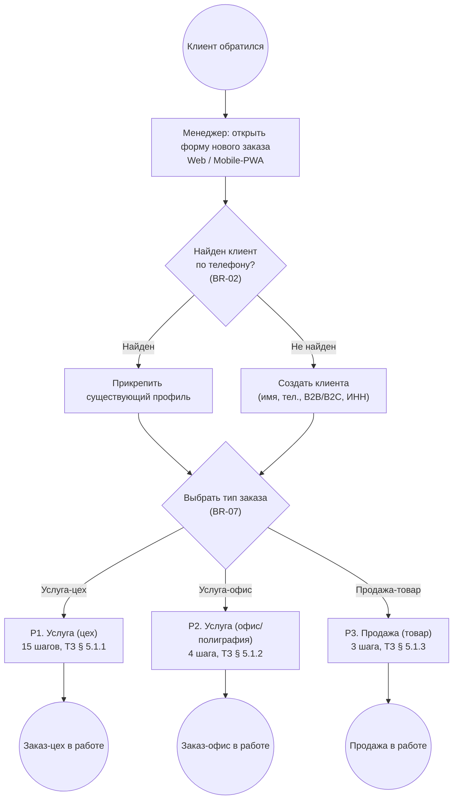

**Пояснение.**

- **Антидублирование клиента (BR-02).** Поиск идёт по нормализованному
  телефону через `libphonenumber` — `+7`, `8`, `7-XXX-...`, `+7 (XXX)`
  приводятся к единому формату. При неоднозначности — fuzzy-match по
  имени с подсказкой «возможно, это один клиент».
- **Выбор типа (BR-07).** Это **обязательное** поле, защищено валидацией
  на бэке. Без типа заказ не сохраняется. Тип нельзя поменять после
  создания (только отмена + новый заказ).
- **Услуги — только из справочника (BR-04).** Поле «услуга» — селект
  из `apps/catalog`, ручной ввод запрещён enforce'ом на бэке.

**Точки риска:** O3 (формат телефона), C2 (клиент создаёт сам в
кабинете — see J10).

---

## P1. Услуга (цех) — наружная реклама

> **ТЗ § 5.1.1** — самый длинный процесс, 15 шагов от первого контакта
> до выдачи / монтажа. Эталон статус-машины.

### P1.1. Шаги 1–8: лид → дизайн → согласование с клиентом

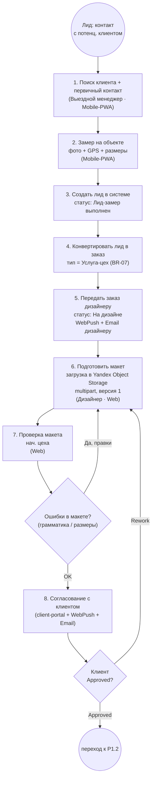

### P1.2. Шаги 9–14: производство → склад → брак-fix

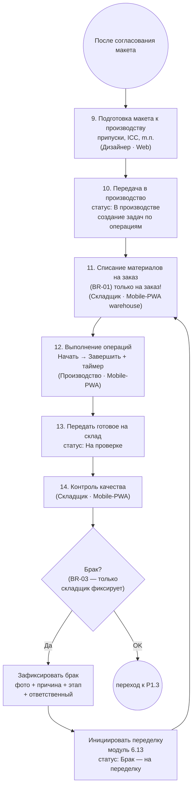

### P1.3. Шаг 15: выдача / монтаж

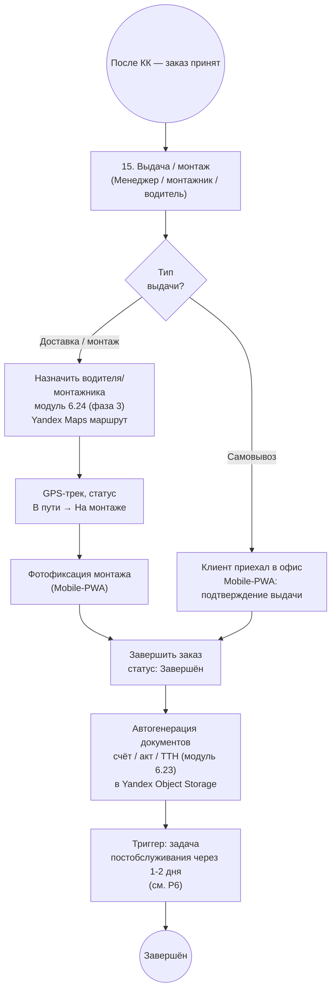

### Статус-машина заказа цеха

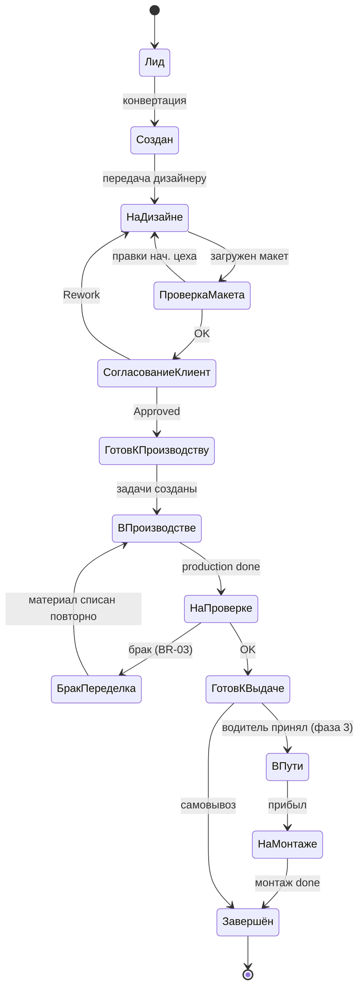

**Пояснение.**

- **Шаг 6 / 9** — макет в **Yandex Object Storage** (🔴 #11 закрыт).
  Multipart upload до 2 ГБ, версионирование через S3 versions API.
- **Шаг 8** — клиент согласует макет в client-portal. Уведомления —
  WebPush + Email (Telegram **не используется**, 🔴 #7).
- **Шаг 11 (BR-01)** — критическая инвариаранта: списание возможно
  **только на заказ**, бэк не позволит создать `MaterialMovement`
  с `order_id = null` для типа «списание». Это решает главную AS-IS
  проблему типографии.
- **Шаг 14 (BR-03)** — брак фиксирует **только складщик**. Производство
  не имеет UI для фиксации. Это устраняет конфликт интересов.
- **Брак-цикл** — при браке материал списывается **повторно на тот же
  заказ** (`order_id = #1234`, type = `defect_rework`). История
  списаний показывает реальный перерасход.

**Открытые вопросы:**
- Кто платит за переделку при браке материала (поставщик / типография /
  клиент)? Уточнить с владельцем.
- Согласование макета: молчание клиента N дней = согласие? Юр. статус
  при претензии.

---

## P2. Услуга (офис / полиграфия)

> **ТЗ § 5.1.2** — оперативная печать, 4 шага.

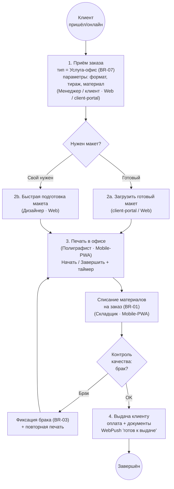

**Пояснение.**

- В отличие от P1, дизайн часто **отсутствует** или сводится к
  минимальной правке — клиент приходит со своим готовым PDF.
- Списание материалов BR-01 действует и здесь: 100 листов A4 — это
  100 единиц SKU «бумага A4 80 г/м²», списанных на заказ.
- BR-03 действует — даже на маленьких тиражах брак фиксирует только
  складщик / контролёр на выдаче.
- Канал нотификации клиенту — WebPush (если PWA / браузер открыт) +
  Email-копия + SMS для критичных случаев.

**Открытые вопросы:**
- Срочный заказ «через час» — отдельный тип услуги или наценка к
  обычной? Влияет на каталог.

---

## P3. Продажа (товар)

> **ТЗ § 5.1.3** — реализация со склада готовой продукции, 3 шага.

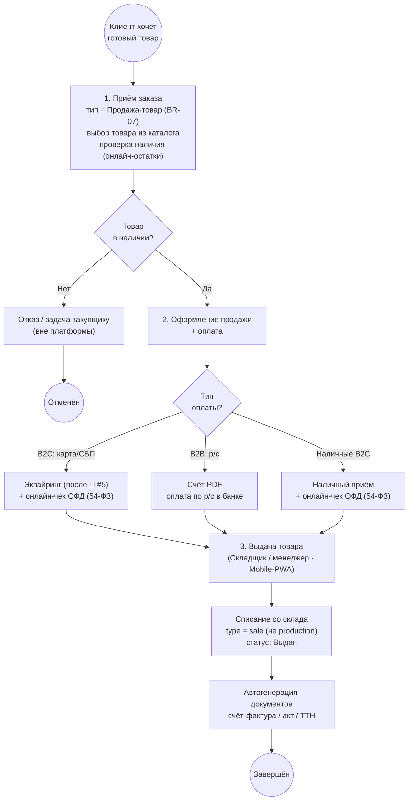

**Пояснение.**

- **54-ФЗ применим** — по ответу 🔴 #14 (закрыт) типография работает
  с миксом B2B + B2C → ОФД-провайдер нужен. Под-блокер от 🔴 #5
  (эквайринг + ОФД-провайдер выбираются вместе).
- Тип движения — `sale`, отличается от `production` (списание на
  производство по BR-01). В аналитике это разные категории.
- Для B2B клиент получает счёт PDF и оплачивает по р/с — пробитие
  чека не требуется.
- BR-03 формально не применим — товар уже готов. Но при возврате
  клиентом → товар заново проверяется складщиком.

**Открытые вопросы:**
- **Возвраты товара** — отдельный workflow, не описан в ТЗ. Включает
  чек коррекции через ОФД (54-ФЗ ст. 4.7). Фаза 2+.

---

## P4. Управление складом

> **ТЗ § 5.2.1, 5.2.2** + модуль 6.11. Три сценария: приёмка,
> списание (BR-01), инвентаризация.

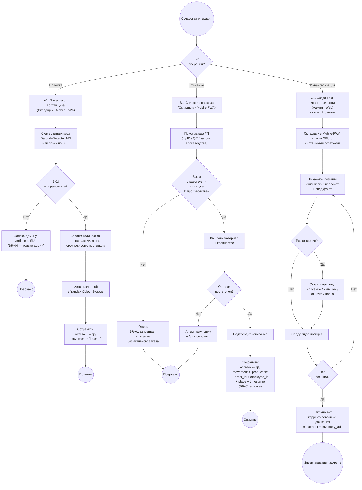

**Пояснение.**

- **BR-01 enforce.** Бэк отказывает в `MaterialMovement` если
  `type = 'production'` и `order_id IS NULL`. Список разрешённых
  типов: `income` (приёмка), `production` (на заказ — обязателен
  `order_id`), `sale` (продажа товара — обязателен `order_id` тип
  «продажа-товар»), `inventory_adj` (корректировка по акту), `defect`
  (брак — обязателен `order_id` исходного заказа).
- **BR-04 enforce.** Создавать SKU может только админ (модуль 6.4).
  Складщик при приёмке нового материала **не может** создать SKU
  на лету — только заявка админу.
- Сканер штрих-кода — Web Platform API `BarcodeDetector` (поддержка
  Chrome / Edge на Android). Для iOS PWA — fallback на ручной ввод
  или фотография ID карточки материала.

**Точки риска:** O3 (антидубль материалов), O5 (справочник с нуля),
T6 (offline-mode при приёмке без Wi-Fi на складе).

---

## P5. Контроль качества и брак (BR-03)

> **ТЗ § 5.1.1.13–14** + модули 6.12, 6.13. Складщик — **единственный**
> фиксатор брака. Эта инвариант устраняет конфликт интересов.

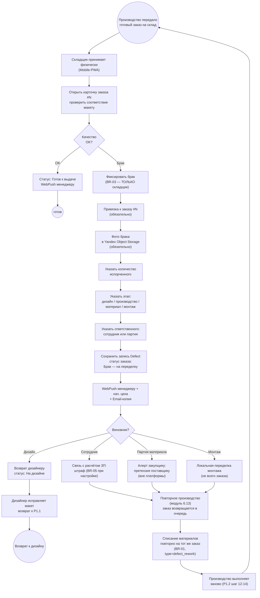

**Пояснение.**

- **BR-03 enforce.** UI «Фиксировать брак» виден **только** роли
  «Складщик» и «Администратор» (для админ-исправлений). Производство,
  дизайн, менеджер не могут создать запись `Defect`.
- **Обязательность фото.** Без фото запись `Defect` не сохраняется
  (валидация на бэке). Фото — в Yandex Object Storage с привязкой к
  `defect_id` и `order_id`.
- **Этап брака** — фиксируется в `Defect.stage`: `design` / `production`
  / `material` / `assembly`. По этапу — разная маршрутизация
  переделки.
- **Связь с ЗП.** При `stage = production` и установленном
  `responsible_employee_id` — в фоновую задачу расчёта ЗП передаётся
  штраф (формула штрафа уточняется при настройке `apps/payroll`,
  продолжение 🔴 #8).
- **Bottleneck-риск (O2).** При одном складщике — очередь «На
  проверке» может расти. Митигация — дублирующий складщик в смене
  или роль «помощник» в фазе 2+.

**Открытые вопросы:**
- Что делать с браком на этапе **материала** — кто оплачивает повторное
  списание (типография / поставщик)? Зависит от условий контракта
  с поставщиком.
- Возможны ли «частичные» браки (50% тиража годен, 50% брак)? ТЗ
  однозначно не говорит. Нужна модель: `Defect.qty` и `Order.qty_total`
  — `Order.qty_done` после переделки.

---

## P6. Постобслуживание клиента

> **ТЗ § 5.2.3, модуль 6.17.** Через 1-2 дня после выдачи — задача-
> звонок для сбора обратной связи.

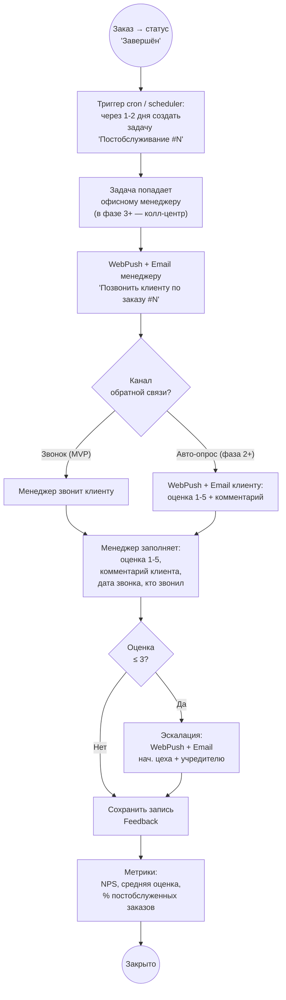

**Пояснение.**

- **Канал в MVP — звонок.** Менеджер открывает задачу в Web-кабинете,
  звонит, заполняет форму. В фазе 3+ — колл-центр (отдельный модуль).
- **Авто-опрос — фаза 2+.** WebPush в кабинете с короткой формой
  «Оцените заказ 1-5 + комментарий». Email-копия. Telegram **не
  используется** (🔴 #7).
- **Эскалация при низкой оценке** — алерт нач. цеха + учредителю.
  Низкая оценка может говорить о скрытом браке, который не выявил
  складщик.
- **Метрики** — попадают в Owner Dashboard (J11): NPS, средняя оценка,
  % постобслуженных заказов.

**Открытые вопросы:**
- При оценке ≤ 3 — обязателен ли follow-up звонок учредителя? Или
  достаточно эскалации в систему?
- Сколько раз пытаться дозвониться, если клиент не отвечает?

---

## P7. Сдельная ЗП — конец периода

> **Модуль 6.22, расчёт 7.15, BR-05.** Двойная формула (тариф ₽ × кол-во
> **или** % от стоимости работы — 🔴 #8 закрыт). Активируется в
> фазе 2.

### P7.1. Расчёт за сотрудника

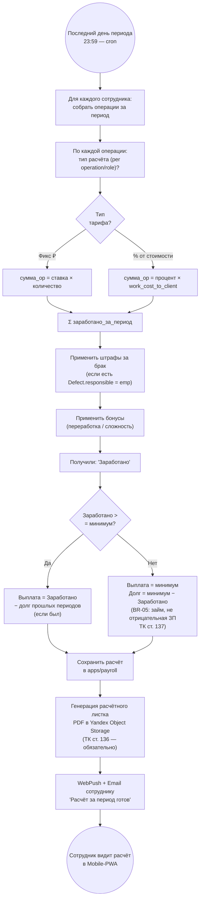

### P7.2. Статус-машина расчёта периода

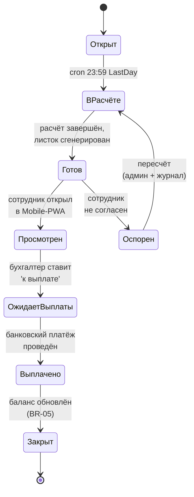

**Пояснение.**

- **Двойная формула (🔴 #8).** Per operation / role админ настраивает
  один из двух типов:
  - `tariff_fixed` — `сумма = rate × qty` (например, 50 ₽ × 10 шт.
    напечатанных листов).
  - `tariff_percent_of_work` — `сумма = percent × work_cost_to_client`
    (например, 8% от стоимости работы для клиента; при изменении
    прейскуранта — заморозка ставки на дату операции через audit-log).
- **BR-05 — ТК ст. 137.** Если за период заработал меньше минимума —
  компания доплачивает разницу как **займ** (`balance += минимум −
  заработано`). В следующем периоде — погашение из заработанного.
  Никогда не уход в минус — выплата всегда ≥ 0.
- **Расчётный листок (ТК ст. 136).** Обязательная генерация PDF
  с детализацией: операции, тарифы, штрафы, бонусы, итого,
  баланс / долг. Хранение 5 лет (402-ФЗ).
- **Тесты на крайних случаях.** 0 операций (минимум только), `balance`
  > 0 (есть долг с прошлого), увольнение с долгом (списание долга или
  взыскание через суд — отдельный workflow), переполнение лимита
  удержаний 20% по ст. 138.

**Точки риска:** T5 (сдельная ЗП vs ТК — критический риск, скор 15).

**Открытые вопросы:**
- Минимум за период — сумма (₽/мес)? Уточняется примерами расчёта.
- Штрафы за брак — фикс ₽, % от заказа или удержание стоимости
  материала? Уточняется при настройке `apps/payroll`.
- Бонусы — за переработку / сложные заказы / выслугу лет — какие
  правила? Уточняется.

---

## P8. Face Control — события и корректировка

> **Модуль 6.20, BR-06.** События **не редактируются** сотрудником,
> только просмотр. Корректировка времени смены — через отдельный
> workflow с журналом.

### P8.1. Sequence — поток событий vendor → backend

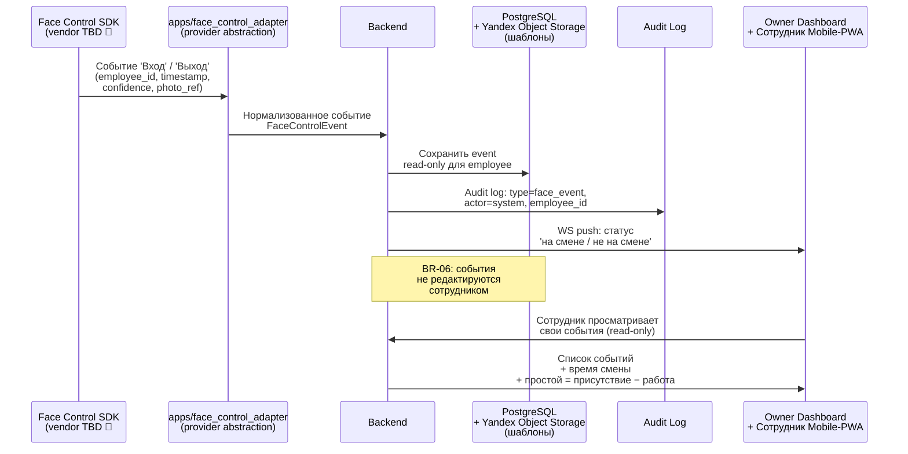

### P8.2. Корректировка времени смены — workflow с журналом

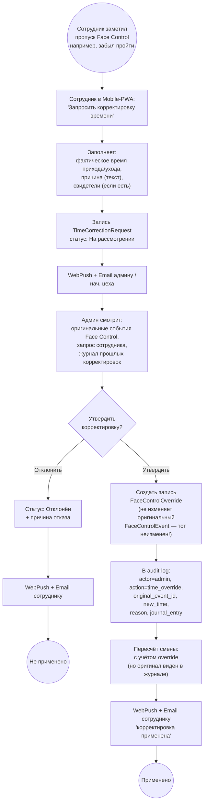

**Пояснение.**

- **BR-06 enforce.** Таблица `FaceControlEvent` — **append-only**.
  Бэк не предоставляет эндпойнтов на UPDATE / DELETE для этой таблицы
  (только админский SQL-доступ для исправления багов с журналированием).
- **Корректировка через override.** Если оригинальное событие не
  должно (по уважительной причине) применяться — создаётся отдельная
  запись `FaceControlOverride`. Расчёт времени смены берёт оригинал
  + applicable overrides. В UI сотрудник видит и оригинал, и override
  с указанием «скорректировано админом, причина: ...».
- **Журнал корректировок.** Все `TimeCorrectionRequest` и
  `FaceControlOverride` — в audit-log. История доступна владельцу
  (для контроля «не злоупотребляет ли админ»).
- **Биометрические шаблоны** хранятся в **нашем** Yandex Object Storage
  (не у вендора), шифрование at-rest, отдельный KMS-ключ через
  Yandex Lockbox (после ADR-0003 хостинга).
- **152-ФЗ ст. 11.** Перед первым включением Face Control сотруднику
  — обязательное **письменное** согласие (бумага + Mobile-PWA) с
  timestamp + хеш версии политики. Без согласия — no enrollment.

**Точки риска:** T1 (vendor-lock), T2 (точность Face Control при
потоке), T3 (биометрия 152-ФЗ ст. 11), T10 (утечка биометрии).

**Открытые вопросы:**
- Кто авторизует override — нач. цеха или только админ?
  Если нач. цеха — риск злоупотребления для своих сотрудников.
- Лимит на количество корректировок в месяц на сотрудника? (например,
  не более 2 — иначе triggered review учредителя).
- При увольнении сотрудника — что делать с биометрическим шаблоном?
  152-ФЗ ст. 14 = удаление по запросу субъекта; нужен явный workflow.

---

## Владельцы процессов

Владелец процесса = роль, которая отвечает за корректность исполнения
end-to-end. Один владелец у каждого процесса. Owner-роли — из
[`team-structure.md`](team-structure.md).

| Процесс | Бизнес-владелец (типография) | Системный владелец (UniPrint-команда) |
| --- | --- | --- |
| **P0 Роутер типа заказа** | Менеджер по продажам / клиент | PM Delivery |
| **P1 Услуга-цех** | Нач. цеха | PM Delivery + Architect |
| **P2 Услуга-офис** | Менеджер | PM Delivery |
| **P3 Продажа-товар** | Менеджер | PM Delivery |
| **P4 Управление складом** | Складщик | Engineering Lead |
| **P5 Контроль качества и брак** | Складщик (BR-03) | Engineering Lead + UX |
| **P6 Постобслуживание** | Офисный менеджер (фаза 1-2), колл-центр (фаза 3+) | PM Delivery + Growth |
| **P7 Сдельная ЗП** | Учредитель + бухгалтер | Compliance + CFO + Engineering Lead |
| **P8 Face Control** | Учредитель + админ | Compliance + Architect + Senior Frontend |

---

## Открытые вопросы по процессам

Список всех вопросов, поднявшихся при формализации процессов в Mermaid.
Передаются в `Docs/onboarding/owner-questions.md` (как follow-up
к закрытым 🟡 / 🟢) или в `Docs/04-modules.md` как TBD при детализации
модулей.

| # | Процесс | Вопрос | Кому |
| --- | --- | --- | --- |
| Q-P1-1 | P1 шаг 6-8 | При браке материала — кто оплачивает повторное списание (типография / поставщик / клиент)? | Владелец |
| Q-P1-2 | P1 шаг 8 | Молчание клиента N дней при согласовании = согласие? Юр. статус. | Юрист-аутсорс |
| Q-P1-3 | P1 шаг 11 | Можно ли частично списать материал (например, 5 м² из требуемых 6 м², докупить позже)? Влияет на статус заказа. | Владелец + R3 |
| Q-P2-1 | P2 | Срочный заказ «через час» — отдельный тип услуги или наценка? | Владелец |
| Q-P2-2 | P2 шаг 2 | Pre-flight валидация макета (припуски, ICC) — на клиенте в браузере или на бэке? | R3 + Architect |
| Q-P3-1 | P3 | Возвраты товара — workflow (включая чек коррекции через ОФД). Не описан в ТЗ. | Владелец |
| Q-P4-1 | P4 приёмка | Сканер штрих-кода на iOS PWA не работает (нет BarcodeDetector). Fallback — фото + OCR или ручной ввод? | UX + Architect |
| Q-P4-2 | P4 списание | Backorder при недостатке материала — позволять создавать «отложенное» списание или жёстко блокировать? | Владелец |
| Q-P4-3 | P4 инвентаризация | Раз в какой период — месяц / квартал? Кто инициирует — админ или автоматически по расписанию? | Владелец |
| Q-P5-1 | P5 | Частичный брак (50% тиража годен) — модель `qty_done` vs `qty_total`. Нужно явно. | Architect + Владелец |
| Q-P5-2 | P5 | Брак на материале — кто фиксирует партию как «бракованную» и блокирует её для списания? Складщик при приёмке или при выявлении? | Владелец |
| Q-P6-1 | P6 | При оценке ≤ 3 — обязателен ли follow-up звонок учредителя? | Владелец |
| Q-P6-2 | P6 | Сколько раз пытаться дозвониться, если клиент не отвечает? | Владелец |
| Q-P7-1 | P7 | Минимум за период — сумма ₽/мес (МРОТ / фикс / другое)? | Владелец (продолжение 🔴 #8) |
| Q-P7-2 | P7 | Штрафы за брак — фикс ₽ / % от заказа / удержание стоимости материала? | Владелец (продолжение 🔴 #8) |
| Q-P7-3 | P7 | Бонусы — за переработку / сложные заказы / выслугу лет — какие правила? | Владелец (продолжение 🔴 #8) |
| Q-P7-4 | P7 | Увольнение сотрудника с долгом — списание долга или взыскание через суд? | Владелец + Юрист |
| Q-P7-5 | P7 | При изменении прейскуранта посередине периода — заморозка ставки на дату операции? | Architect + CFO |
| Q-P8-1 | P8 | Кто авторизует override времени смены — нач. цеха или только админ? | Владелец |
| Q-P8-2 | P8 | Лимит корректировок в месяц на сотрудника? | Владелец |
| Q-P8-3 | P8 | При увольнении — workflow удаления биометрического шаблона (152-ФЗ ст. 14)? | Compliance + Юрист |

---

## Связь с другими документами

- **Текстовое описание процессов** — [`02-user-journeys.md`](02-user-journeys.md)
  (J1–J14).
- **Бизнес-правила, упомянутые в диаграммах** —
  [`../BUSINESS_RULES.md`](../BUSINESS_RULES.md) (BR-01..07).
- **Модули, реализующие процессы** — [`04-modules.md`](04-modules.md)
  (детализация 25 модулей ТЗ).
- **Риски, связанные с процессами** — [`08-risks.md`](08-risks.md):
  - P5 (брак-fix workflow) → O2 (складщик-bottleneck);
  - P7 (сдельная ЗП) → T5 (ТК РФ);
  - P8 (Face Control) → T1 (vendor-lock), T2 (точность), T3 (152-ФЗ).
- **Архитектура** — [`03-architecture.md`](03-architecture.md) (как
  процессы реализуются в коде: микросервисы / модули).
- **Compliance** — [`09-compliance.md`](09-compliance.md):
  - P7 → ТК ст. 136-137;
  - P8 → 152-ФЗ ст. 11 (биометрия);
  - P1 шаг 11, P4 списание → audit-log по 402-ФЗ.

## Эволюция этого документа

| Триггер | Что обновить |
| --- | --- |
| Новый процесс выявлен (например, «Возврат товара» в P3) | Добавить раздел P9+ + диаграмму + владельцев + открытые вопросы |
| Изменилась статус-машина заказа | Обновить P1 / P2 / P3 + статус-диаграммы |
| Новое бизнес-правило (BR-08) | Найти все места, где BR применяется → обновить пояснения |
| 🔴 ответ закрыл TBD | Заменить TBD на конкретное решение, обновить точки риска |
| Изменилась команда / роли | Обновить таблицу владельцев процессов |

После обновления — короткая запись в `Docs/log.md` (правило **B**
из `CLAUDE.md`).

## Ссылки

- [00-summary.md](00-summary.md) — executive summary
- [01-vision.md](01-vision.md) — продуктовое видение
- [02-user-journeys.md](02-user-journeys.md) — текстовая версия процессов
- [04-modules.md](04-modules.md) — модули, реализующие процессы (TBD)
- [08-risks.md](08-risks.md) — риск-карта
- [team-structure.md](team-structure.md) — owner-роли
- [`../BUSINESS_RULES.md`](../BUSINESS_RULES.md) — BR-01..07
- [tz-po-uniprint.md § 5](tz-po-uniprint.md) — исходные BPMN (текст)
- [tz-po-uniprint.md § 10.1](tz-po-uniprint.md) — Miro-ссылки на исходные диаграммы
- [onboarding/owner-questions.md](onboarding/owner-questions.md) — открытые вопросы
